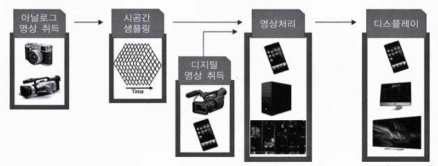

# Chapter 1-1: 디지털 영상처리 개념 - 작성자: 서영은

# 1. 발전 과정

**`디지털 영상처리란?`** 입력된 영상을 디지털로 처리하는 과정과 시스템 기술을 총칭한다.

아날로그 → 디지털로 변화.

## 📼 아날로그 영상처리

**1900년대 중반까지는 아날로그 기반**으로 영상처리가 이루어졌다.

**처리 방법 또한 대부분 광학과 관련된 것**으로, 렌즈를 이용한 화학 필름 카메라가 가장 대표적인 예.

렌즈 굴절률을 이용하여 특수 영상을 취득하거나 특수 필터 등의 광학적인 특성을 이용하는 것도 있다.

**전문 지식과 특수 장비가 필요**해서 대중적으로 보급되기 어려운 기술이었으며, 보통 학문의 한 분야 혹은 전문 기술의 한 분야로 취급되었다.

## 📺 디지털 영상처리

**디지털 기기가 보급되면서부터** 영상처리가 일반인에게도 친숙해졌다.

영상처리 기술을 응용한 가장 대표적인 것은 **텔레비전**의 보급으로 볼 수 있다.

**3차원 장면을 1차원의 연속 아날로그 신호로 변환한 뒤 전송하여 재생**하는 텔레비전은 영상처리 분야에서 가장 획기적으로 성공한 제품으로 볼 수 있다.

아날로그 카메라와 텔레비전 기술을 바탕으로 현대에는 디지털카메라나 스마트폰으로 영상을 취득하고 포토샵 등의 컴퓨터 프로그램이나 이미지 처리 앱으로 영상을 가공하는 등 다양한 방향으로 발전하고 있다.

# 2. 디지털 영상처리 시스템

아날로그로 취득한 영상을 디지털로 변환한 뒤 컴퓨터로 처리하는 것이 일반적인 영상처리 방법이었다.

그러나 최근에는 취득 장치 자체를 디지털로 구현하여 일반인도 디지털카메라나 디지털 TV 등의 영상장비를 통해 디지털 영상을 흔히 볼 수 있게 되었다.

### 아날로그 영상과 비교했을 때 디지털 영상의 장점

- 영상의 취득, 처리, 재현 및 저장이 용이하다.
- 데이터 손실을 배제할 수 있다.

### 아날로그 및 디지털 영상처리의 기본 단계

### **디지털 형태의 데이터를 얻기 위해 중요한 요소**

- 시간축의 샘플링 간격과 공간축의 샘플링 간격
- 영상을 이루는 한 점을 몇개의 밝깃값 단계로 표현하는지

이렇게 취득한 디지털 영상은 디지털 장치에 저장하거나 전송가능하며, 디지털 컴퓨터 혹은 디지털 로직을 통해 변형이나 분석이 가능하다.

디지털 영상처리 장치는 입력 영상에서 특정 정보를 추출하여 다양하게 응용한다.

예) 주차장 출입구에 설치된 차량 입출 관리 시스템

- 차량이 카메라에 접근 → 영상 취득 → 영상으로부터 차량 번호판 추출 → 차량 번호 인식
    - 영상 밝기 정보  — 변환 →  심볼(차량 번호)
    ⇒ **영상처리 결과물이 영상이 아닌 다른 차원의 정보가 되도록 변환**하는 과정

# 3. 영상처리 관련 학문 분야

입력과 출력의 조합에 따라 네 가지로 분류.

이때 입력이나 출력은 모두 영상이나 심볼(symbol)이 될 수 있다.

영상과 심볼의 입출력에 따른 학문 분야

- **입력과 출력이 모두 영상인 경우**
    - 영상처리 (좁은 의미: 저수준 영상처리)
- **입력이 영상, 출력이 심볼인 경우**
    - 영상처리 (좁은 의미: 컴퓨터 비전 (중수준/고수준 영상처리))
- **입력이 심볼, 출력이 영상인 경우**
    - 컴퓨터 그래픽
- **입력이 단순한 형태의 심볼, 출력이 그보다 더 깊은 의미인 심볼인 경우**
    - AI (자연어 처리)