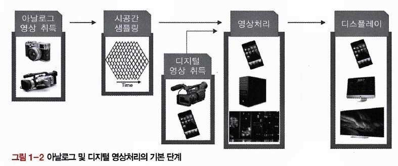

# 1장 과제

## 연습과제

1. 아날로그와 디지털 영상처리 시스템의 차이점에 대하여 설명하시오.
2. 디지털 영상처리 시스템의 단계를 제시하고, 단계별 입출력을 설명하시오.
3. 영상처리 학문 분야를 네가지로 분류하고 각각의 입출력과 해당 과정을 설명하시오.
4. 영상처리 기술 분야를 제시하고, 각각의 특징을 설명하시오.
5. 본 책에서 제시한 영상처리 응용 이외에 다른 영상처리 응용 방법을 제시하시오.

## 프로젝트 과제

지금까지 수많은 영상처리 응용 장치가 개발 및 상용화되었다. 미래에는 영상처리 기술을 기반으로 한 어떤 응용 제품이 가능할지 제시하고 해당 제품을 구현하기 위해 필요한 기술을 제시하시오. 제품 필요성, 대량 생산 가능성, 편의성, 디자인 및 가격 경쟁력, 불량에 따른 법률적 다툼 가능성 등에 대하여 논하시오.

---

# 지윤

## 연습과제

1. 아날로그와 디지털 영상처리 시스템의 차이점에 대하여 설명하시오.
- 아날로그 영상은 **연속적인 신호**로 표현할 수 있다. 즉, 자연에서 관찰되는 빛의 세기, 바람의 풍량 처럼 끊김 없이 부드럽게 변하는 값을 사용한다. 또한 아날로그 영상 처리는 렌즈를 이용한 화학 필름카메라와 같이 광학적인 도구를 주로 사용하게 된다. 하지만 아날로그의 경우 노이즈에 취약한 경우가 많다.
- 디지털 신호는 **이산적인 신호**로 이루어져있다. 연속되지 않은 값을 가지고 있게되며 디지털 영상도 마찬가지로 픽셀 단위의 이산적인 신호로 이루어져있다. 각 픽셀에서는 RGB,HSV 등을 저장한다. 따라서 디지털 영상처리는 이렇게 수치화된 데이터를 컴퓨터로 계산하여 처리하는 것이다. 하지만 디지털 영상을 확대하여 보았을 때, 픽셀이 깨지는 현상을 관찰할 수 있게되지만 노이즈에 강하고 컴퓨터의 성능 향상 측면에서는 디지털 방식이 저장과 처리에 유리하다.

---

1. 디지털 영상처리 시스템의 단계를 제시하고, 단계별 입출력을 설명하시오.
    
    
    
    - 아날로그 영상 취득
        - 입력: 광학적인 요소(빛의 강도, 색 등)
        - 출력: 시간과 공간적으로 연속적인 전기 신호(연속적인 파형)
    - 시공간 샘플링
        - 시공간 샘플링이란?
            - 공간: 평면상의 점(=픽셀 위치)을 일정 간격으로 뽑아내는 것
            - 시간: 동영상이라면 시간에 따라 여러 장면을 일정 간격으로 뽑는 것
            - 즉, 아날로그 영상 신호를 일정 간격으로 끊어서 수치화하는 과정
        - 입력: 아날로그 영상 신호
        - 출력: 샘플링된 이산 신호(아날로그 영상을 작은 격자로 나눠서 수치로 바꿈 → 디지털 정보)
    
    **🚨 과제는 여기서 부터입니다**
    
    - 디지털 영상 취득
        - 입력: 광학적인 요소
        - 출력: 디지털 영상 데이터(픽셀 단위로 숫자로 저장된 영상)
    - 영상 처리
        - 입력: 디지털 영상 데이터
        - 출력: 계산을 거처 가공된 디지털 영상 또는 다른 차원의 정보(객체 위치, 번호판 숫자 등)가 되도록 변환됨
    - 디스플레이
        - 입력: 디지털 영상 데이터
        - 출력: 시각적으로 보이는 영상

1. 영상처리 학문 분야를 네가지로 분류하고 각각의 입출력과 해당 과정을 설명하시오.
    
    
    
    - 영상처리(저수준 영상처리)
        - 영상 자체를 개선하거나 변형함
        - 입출력: 영상
    - 컴퓨터 그래픽
        - 정보를 바탕으로 영상을 만들어 냄
        - 입력: 심볼
        - 출력: 영상
    - 컴퓨터 비전(중수준/고수준 영상처리)
        - 영상 속 의미를 해석하고 정보를 뽑아냄
        - 입력: 영상
        - 출력: 심볼
    - AI(자연어 처리)
        - 심볼을 이해하고 해석해서 더 의미있는 정보로 바꾸는 과정
        - 입력: 단순한 형태의 심볼
        - 출력: 그보다 더 깊은 의미를 가지는 심볼

1. 영상처리 기술 분야를 제시하고, 각각의 특징을 설명하시오.
    
    
    
    - 영상 개선
        - 영상의 화질을 주관적으로 향상시키는 기술
        - 취득한 영상을 보기 좋은 화질로 변환하는 기술이므로, 결과물이 원본 혹은 취득 당시의 실제 신호와 다를 수 있다.
    - 영상 복원
        - 어떠한 이유로 손상된 영상을 원본 이미지로 되돌리는 것이 목적
        - 복원 후의 영상이 원본에 가까운 값을 가질수록 복원이 잘되었다고 할 수 있으므로, 객관적인 화질 향상 기술이다.
    - 영상 변환
        - 밝기 및 색 성분의 강도로 표현되는 디지털 공간의 영상 데이터를 주파수 평면처럼 물리적으로 다른의미의 공간으로 변환하는 기술
        - 영상 변환 기술 자체는 하나의 목적에 대응되지 않을 수도 있지만, 여러 가지 응용에서 주요한 기술로 사용된다.
    - 영상 분석
        - 특정 처리 과정을 통해 영상이 지닌 특성을 수치화하여 표현하는 기술
        - 디지털 영상은 시공간에 배열된 화소의 집합이며, 각 화소는 밝기 값을 가진다. 이러한 밝깃값의 배열 정보로부터 원하는 정보를 추출하는 과정이다.
    - 영상 인식
        - 지문 인식, 얼굴 인식 등이 여기에 해당하며 입력된 영상을 영상 분석 기술로 수치화하거나 구조적으로 분석하여 DB나 사용자가 제시한 조건에 맞는 의미있는 정보를 추출 및 분류하는 과정이다.
        - 기본적으로 영상을 분석하고 처리하는 과정이 필요하다.
    - 영상 압축
        - 해상도가 큰 영상의 개수가 많아지면 영상의 데이터 크기도 증가하게 된다. 이러한 영상 데이터를 효율적으로 표현하여 저장 및 전송의 효율성을 높이기 위한 기술이다.
        - 예를들어, {200, 199, 205, 210, 215}라는 숫자 집합을 왼쪽 숫자와 차잇값으로 표현한다면 {200, -1, 6, 5, 5}과 같이 더 작은 크기의 숫자로 표현할 수 있고 필요한 비트량이 작아지게된다. 이러한 과정을 영상 부호화라고 하며, 본래 신호로 돌리는걸 복호화라고 한다.

1. 본 책에서 제시한 영상처리 응용 이외에 다른 영상처리 응용 방법을 제시하시오.

AR(증강현실)은 현실 세계 위에 가상의 정보를 덧입힌 기술을 의미하며 현실 화면에 가상의 캐릭터나 오브젝트가 나타나게 된다. 사용자 몸의 움직임, 터치, 위치 등에 상호작용 하게되는 기술이며, 해당 기술에서 손가락 객체를 인식하거나 사람 인식, 카메라 영상을 통해 위치를 추적하는 등 기술이 사용되고 있다.

## 프로젝트 과제

지금까지 수많은 영상처리 응용 장치가 개발 및 상용화되었다. 미래에는 영상처리 기술을 기반으로 한 어떤 응용 제품이 가능할지 제시하고 해당 제품을 구현하기 위해 필요한 기술을 제시하시오. 제품 필요성, 대량 생산 가능성, 편의성, 디자인 및 가격 경쟁력, 불량에 따른 법률적 다툼 가능성 등에 대하여 논하시오.

# 형주

## 연습과제

1. 아날로그와 디지털 영상처리 시스템의 차이점에 대하여 설명하시오.
    
    <aside>
    
    아날로그 영상처리는 주로 렌즈 굴절률을 이용하거나 특수 필터 등의 광학적인 특성을 이용한 처리 방법이 사용되었다. 그러나 당시 기술력의 한계로 인해, 대중적으로 영상 처리 기술이 보급되지는 않았다. 디지털 영상 처리 시스템은 초기에는 아날로그로 취득한 영상을 디지털로 변환한 뒤 컴퓨터로 처리하는 것이 일반적이었다. 그러나 현대에는 취득 장치 자체를 디지털로 구현하여 영상 데이터를 얻고 디지털 컴퓨터 혹은 디지털 로직을 사용하여 변형 및 분석이 가능하다. 
    
    </aside>
    

1. 디지털 영상처리 시스템의 단계를 제시하고, 단계별 입출력을 설명하시오.
    
    <aside>
    
    영상 처리의 시스템은 취득 경로에 따라 시작 단계가 다르다. 아날로그 장치로 영상을 취득한 경우에는 입력된 영상을 시공간 샘플링을 통해 데이터를 얻어 영상 처리 단계로 전달한다. 그러나 디지털 장치는 영상의 취득을 디지털로 하므로 시공간 샘플링을 거칠 필요 없이 영상 처리 단계로 데이터를 전달한다. 각 경로를 통해 얻은 데이터는 필요에 따라 개선, 복원, 변환 등의 과정을 거쳐서 가공된다. 그리고 가공된 데이터는 해당 영상을 재생할 수 있는 디스플레이를 통해 출력된다. 
    
    </aside>
    

1. 영상처리 학문 분야를 네가지로 분류하고 각각의 입출력과 해당 과정을 설명하시오.
    
    <aside>
    
    문자 인식은 문서를 스캐너로 캡처하여 화소의 배열로 취득하는 분야이다. OCR과 같이 문자 코드를 추출하여 검색이나 데이터 처리를 할 수 있다. 문자 인식을 응용하기 위해서는 영상에 대한 인식, 복원, 분석 등 다양한 영상처리 기술이 함께 사용되어야 한다.
    
    영상 처리 기술은 공장 자동화 시스템에서 상황 인지, 불량 검사 등을 위해 사용할 수 있다. 제품의 외관 및 내부, 공장 내부의 상황 등이 입력되면 각 제품의 불량 유무 또는 공장의 위협 정도가 출력될 수 있다.
    
    무인 자동차 분야에서는 자율 주행을 위해 영상 처리를 사용한다. 영상 처리를 사용하여 주변의 요소들을 인식하고 운행에 위협이 될 장애물을 피하도록 정보를 가공하여 제공할 수 있다. 
    
    영상 처리는 인체에 해를 끼치지 않고 체내를 영상화 할 수 있다. 이 기술을 통해 환자의 신체적 손상 없이 인체의 내부의 건강을 위협하는 요소를 파악할 수 있다. 기본적으로 영상 변환, 개선, 분석, 복원 등의 기술을 이용한다.
    
    </aside>
    

1. 영상처리 기술 분야를 제시하고, 각각의 특징을 설명하시오.
    
    <aside>
    
    영상 처리 기술 분야 중 3가지만 제시하겠다. 
    
    영상 개선은 영상의 화질을 특정한 처리 과정을 통해 향상시키는 기술이다. 단, 상황에 따라 개선의 의미가 다를 수 있으므로 향상 결과는 주관적일 수 있다. 기본적으로 인간을 위해 개선을 하는 것이므로 인간의 시각 특징을 고려하여 설계해야 한다. 
    
    영상 변환은 밝기 값 분포나 색 성분의 강도로 표현되는 픽셀 정보나 기하학적인 구조를 물리적으로 다른 의미의 공간으로 변환하는 기술이다. 영상 변환은 하나의 목적만을 가지지 않는다. 주파수 영역 변환은 영상의 개선, 분석 등과 같은 용도로 쓰이지만, 기하학적 변환은 영상의 형태나 위치를 변경할 때 쓰인다.
    
    영상 인식은 입력된 영상을 분석 기술로 수치화 및 구조적 분석을 통해 정보를 처리 및 분류한다. 영상 처리라고 해서 반드시 동적인 정보를 처리하는 것이 아니기 때문에, 정보를 추출하여 데이터베이스에 있는 정보와 비교하고 특정 영상이 데이터베이스에 있는지 여부를 판단할 수도 있다. 
    
    </aside>
    

1. 본 책에서 제시한 영상처리 응용 이외에 다른 영상처리 응용 방법을 제시하시오.
    
    <aside>
    
    책에서 제시하지는 않았지만, 자율 자동차와 비슷하게 무인 비행기를 영상 처리 응용 방법으로 제시할 수 있겠다. 하늘을 비행하므로 장애 요소는 적지만, 혹시나 모를 기체의 사고 상황에서 비상 착륙을 해야 할 때 영상 처리 기술이 사용될 수 있을 것이다. 비상 착륙 시에 관제탑의 명령 및 정보 전달과 기장의 조종 경험에 따라서 안전하게 착륙을 할 수도 있다. 그러나 극단적인 상황에서 인명 피해를 최소화하고 기체를 착륙시키기 위해서 착륙 지점 또는 경로 상의 장애물을 파악할 수 있도록 주변 정보를 분석하는 영상 처리 기술을 활용할 수 있다. 
    
    </aside>
    

## 프로젝트 과제

지금까지 수많은 영상처리 응용 장치가 개발 및 상용화되었다. 미래에는 영상처리 기술을 기반으로 한 어떤 응용 제품이 가능할지 제시하고 해당 제품을 구현하기 위해 필요한 기술을 제시하시오. 제품 필요성, 대량 생산 가능성, 편의성, 디자인 및 가격 경쟁력, 불량에 따른 법률적 다툼 가능성 등에 대하여 논하시오.

<aside>

현재 많은 빅테크 기업들이 영상처리 기술을 기반으로 제품을 사용화하기 위해 노력하고 있다. 그 기업들이 일반적인 소비자를 대상으로 제품이나 서비스를 판매할 것이고, 웬만한 아이디어는 다 나와있으므로 나는 군대를 위한 영상처리 기반 제품에 대한 아이디어를 내보려고 한다. 방산업도 제품을 만드니까 말이다. 

군대의 운용과 작전 계획 수립을 위해서는 전투지 혹은 그에 비준하는 지역들에 대한 지역 정보들이 많으면 많을 수록 좋다고 생각한다. 지역 정보들을 단순한 동영상으로 습득하여 참모나 계원들에게 제공할 수도 있지만, 영상 처리를 통해 정보들을 가공한 뒤 3D로 지도를 제공하는 서비스가 있으면 작전 수립에 도움이 될 것 같다. 

이러한 서비스는 전투의 승리를 위해 있으면 좋은 것이지만, 일반 소비자를 대상으로 하는 것이 아니기 때문에 대량 생산의 필요성과 가능성이 적다. 그러나 군대 예산은 일반적으로 현재와 미래의 안전을 위해 낭비하는 것이 옳은 것이므로 문제가 되지 않는다. 대중에게 판매할 제품이 편의성이나 디자인 등의 요소를 위해 많은 예산이 필요하지는 않다는 장점이 있다. 

</aside>

# 영은

1. 아날로그와 디지털 영상처리 시스템의 차이점에 대하여 설명하시오.
    
    <aside>
    
    아날로그 영상처리는 대부분 광학과 관련된 방식으로 아날로그 기반으로 이루어졌다. 렌즈를 이용한 화학 필름 카메라가 가장 대표적이며, 렌즈 굴절률을 이용하여 특수 영상을 취득하거나 특수 필터 등의 광학적인 특성을 이용하는 것도 있다. 이렇듯 전문 지식과 특수한 장비가 필요한 방법이다.
    
    반면에 디지털 영상처리는 디지털 기기가 보급되면서부터 전문 지식이 없어도 쉽게 접하고 사용할 수 있게 되었다. 영상 취득 장치 자체를 디지털로 구현하게 되면서 아날로그로 취득한 영상을 사용하던 아날로그 방식과는 달리 디지털 영상을 처리할 수 있다. 디지털 영상은 영상의 취득, 처리, 재현 및 저장이 용이하다. 특히, 데이터 손실을 배제할 수 있다는 점이 가장 크다.
    
    </aside>
    
2. 디지털 영상처리 시스템의 단계를 제시하고, 단계별 입출력을 설명하시오.
    
    <aside>
    
    아날로그 영상 취득 → 시공간 샘플링 → 영상 처리 → 디스플레이
    
    - 취득 장치를 통해 아날로그 형태의 영상 데이터 취득.
    - 디지털 형태의 데이터를 얻기 위해 시공간 샘플링
    - 취득한 디지털 영상을 영상 처리
    - 영상처리를 거친 디지털 영상을 재생 장치를 통하여 디스플레이
    
    디지털 영상 취득 → 영상 처리 → 디스플레이
    
    - 디지털 영상을 취득하는 경우는 시공간 샘플링의 과정이 생략된다.
    </aside>
    
3. 영상처리 학문 분야를 네가지로 분류하고 각각의 입출력과 해당 과정을 설명하시오.
    
    <aside>
    
    - 영상 처리 (저수준 영상처리)
        - 입력: 영상, 출력: 영상
    - 컴퓨터 비전 (중수준/고수준 영상처리)
        - 입력: 영상, 출력: 심볼
    - 컴퓨터 그래픽
        - 입력: 심볼, 출력: 영상
    - AI (자연어 처리)
        - 입력: 단순한 형태의 심볼, 출력: 입력보다 깊은 의미를 갖는 심볼
    </aside>
    
4. 영상처리 기술 분야를 제시하고, 각각의 특징을 설명하시오.
    
    <aside>
    
    - 영상 개선
        - 영상의 화질을 주관적으로 향상시키는 기술
        - 결과물이 원본 혹은 취득 당시의 실제 신호와 다를 수 있음.
        - 객관적 관점에서 원래 신호를 복원 X, 보기에 좋은 영상으로 변환 O
        - ⇒ 인간의 시각 특징과 관련된 휴먼팩터를 고려해야 함.
    - 영상 복원
        - 손상된 영상을 원본 이미지로 되돌리는 것
        - 복원 후의 영상이 원본에 가까운 값을 가질 수록 복원이 잘 된것이므로 객관적인 화질 향상 기술이라 할 수 있음.
        - 영상 개선처럼 항상 주관적 화질 개선을 보장하지는 않음
    - 영상 변환
        - 밝기 및 색 성분의 강도로 표현되는 디지털 공간의 영상 데이터를 주파수 평면처럼 물리적으로 다른 의미의 공간으로 변환하는 기술
        - Fourier 변환, DCT 변환 등이 있음.
    - 영상 분석
        - 영상이 지닌 특성을 수치화하여 표현하는 기술
        - 구조적 정보와 통계 정보 혹은 수치를 추출할 수 있음
        - 추출된 정보를 원래 영상으로 되돌릴 수 없다.
    - 영상 인식
        - 입력된 영상을 영상 분석 기술로 수치화하거나 구조적으로 분석하여 데이터베이스나 사용자가 제시한 조건에 맞는 의미 있는 정보를 추출 및 분류하는 과정
        - 지문 인식, 얼굴 인식 등이 있다.
    - 영상 압축
        - 해상도가 커지고 영상의 개수가 많아지면 그에 비례하여 영상 데이터의 크기도 증가함. 이러한 영상 데이터를 효율적으로 표현하여 저장 및 전송의 효율성을 높이기 위한 기술
        - 손실 압축, 무손실 압축이 있음.
        - 손실 압축이더라도 손실이 적고 압축률이 크다면 좋은 압축 방법임.
    </aside>
    
5. 본 책에서 제시한 영상처리 응용 이외에 다른 영상처리 응용 방법을 제시하시오.
    
    <aside>
    
    </aside>
    

## 프로젝트 과제

지금까지 수많은 영상처리 응용 장치가 개발 및 상용화되었다. 미래에는 영상처리 기술을 기반으로 한 어떤 응용 제품이 가능할지 제시하고 해당 제품을 구현하기 위해 필요한 기술을 제시하시오. 제품 필요성, 대량 생산 가능성, 편의성, 디자인 및 가격 경쟁력, 불량에 따른 법률적 다툼 가능성 등에 대하여 논하시오.

<aside>

</aside>