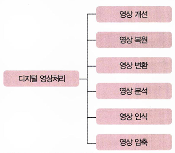

# Chapter 1-2: 디지털 영상처리 분야 - 작성자: 서영은

<aside>

### 💡이것만은 잊지말자!

- 디지털 영상처리 기술분야의 각 특징 및 차이점
</aside>

---

# 1. 기술 분야



디지털 영상처리의 기술 분야

- mermaid 사용해서 그래프 그려봤는데 너무 별로여서 가려뒀어요.. 어떻게 쓰는거지 참고만 하시기
    
    ```mermaid
    graph LR
        A[디지털 영상처리] --> B[영상 개선]
        A --> C[영상 복원]
        A --> D[영상 변환]
        A --> E[영상 분석]
        A --> F[영상 인식]
        A --> G[영상 압축]
    ```
    

## **영상 개선**

- **영상의 화질을 주관적으로 향상시키는 기술**
- 예) 명암 대비 변화로 영상 뚜렷하게 만들기, 블러링된 영상을 선명하게 바꾸기 등
- 취득한 영상을 보기 좋은 화질로 변환하는 기술이므로, 결과물이 원본 혹은 취득 당시의 실제 신호와 다를 수 있음.
- 즉, 객관적 관점에서 원래 신호를 복원하는 것이 아니라, 보기에 좋은 영상으로 변환하는 것.
⇒ 따라서, 인간의 시각 특징과 관련된 **휴먼팩터**를 고려해야 함
    - **`휴먼팩터`**: 상품, 시스템, 절차를 설계할 때 상호 작용하는 인간의 특성을 고려하는 설계와 방법론

## **영상 복원**

- **손상된 영상을 원본 이미지로 되돌리는 것을 목적으로 함.**
- 영상을 취득한 시스템의 결함이나 저장 또는 전송 과정에서 **데이터가 훼손되면 영상 왜곡 발생**
- 복원 후의 영상이 원본에 가까운 값을 가질수록 복원이 잘되었다고 할 수 있으므로, **객관적인 화질 향상 기술**임.
- 영상 복원 기술이 적용된 영상은 항상 보기 좋은 화질을 가지는 것은 아님
    - 객관적 화질뿐만 아니라 주관적 화질이 개선되기도 하지만, 영상 개선처럼 주관적 화질 개선을 보장하지 않는다.
- 영상이 **훼손된 원인을 찾아 모델링한 뒤 역변환하는 방식**을 많이 사용함
    - 따라서, **훼손 원인을 파악하는 것이 매우 중요**.

## **영상 변환**

- **밝기 및 색 성분의 강도로 표현되는 디지털 공간의 영상 데이터를 주파수 평면처럼 물리적으로 다른 의미의 공간으로 변환하는 기술**
- 하나의 목적에 대응되지 않을 수 있지만, 여러 가지 응용에서 주요한 기술로 사용됨.
- 예) Fourier 변환(푸리에 변환), DCT 변환 등
    - 이 두 변환에 대해서는 4장에서 자세히 설명.

## **영상 분석**

- **특정 처리 과정을 통해 영상이 지닌 특성을 수치화하여 표현하는 기술**
- 디지털 영상은 시공간에 배열된 화소의 집합이며, 각 화소는 밝깃값을 가진다.
- 영상분석은 이러한 **밝깃값의 배열 정보로부터 원하는 정보를 추출하는 과정.**
- **`추출할 수 있는 정보`**
    - **구조적 정보**: 인간이 이해할 수 있는 구조적 정보. 입력 영상에서 윤곽선 추출, 영역 분리.
    - **통계 정보**: 인간이 이해할 수 없는 통계 정보 혹은 수치. 입력 영상의 밝깃값 분포나 평균값 등
- **`영상 변환과 차이점`**: **추출된 정보를 다시 원래 영상으로 되돌릴 수 없음**.

## **영상 인식**

- **입력된 영상을 영상 분석 기술로 수치화하거나 구조적으로 분석하여 데이터베이스나 사용자가 제시한 조건에 맞는 의미 있는 정보를 추출 및 분류하는 과정**
- 예) 지문 인식, 얼굴 인식 등
- 영상 인식을 위해서 기본적으로 영상 분석 및 처리 과정이 필요.
- 최근에는 딥러닝을 기반으로 한 AI 기술이 활발하게 적용 중

## **영상 압축**

- **영상 데이터를 효율적으로 표현하여 저장 및 전송의 효율성을 높이기 위한 기술**
- 영상은 픽셀(화소)의 집합으로 이루어져 있음. 가로와 세로 방향의 2차원 배열 형태를 한 순간의 영상이라고 하며, 이러한 픽셀 수를 **`해상도`**라고 함
- 하나의 픽셀은 영상의 밝깃값이나 색 요소의 크깃값을 나타냄
- 하나의 영상을 표현하려면 매우 많은 값의 집합이 필요함
- 즉, 해상도가 커지고 영상의 개수가 많아지면 그에 비례하여 영상 데이터의 크기도 증가함.
    - **부호화**: 데이터를 표현하는 비트량을 줄이는 과정
    - **복호화**: 부호화된 데이터를 본래의 신호로 복원하는 과정

### 압축 방법 2가지

- **무손실 압축**
    - 원본 영상과 동일한 복원 결과를 가지는 압축 방법
- **손실 압축**
    - 부/복호화 과정에서 손실이 발생하여 원본 영상과 복호화 영상이 달라지는 압축 방법
    - 압축 비율에 따라 영상의 화질 저하 발생.
- 손실 압축이더라도 손실은 적고 압축률은 크다면 좋은 압축 방법임.

---

# 2. 활용 분야

## **영상 재생 장치**

- 예) 디지털 TV, DVD 플레이어, 블루레이 플레이어 등
- 디지털 TV 자체와 함께 디지털 TV 콘텐츠나 VOD 서비스를 제공하는 쪽에는 더 많은 영상처리 기술이 적용되었음.
- 디지털 TV에는 동영상을 압축하고 전송된 압축 비트열로부터 영상을 복원하는 기술이 적용될 것.
- 동영상 복원 기술, 변환 기술을 비롯해 최종 화질 및 색감을 향상시키는 화질 개선 기술 등도 적용될 것.

## **디지털카메라**

- 휴대폰의 기본 기능이 될 정도로 소형화 기술이 발전하였음.
- 성능 또한 기존의 디지털카메라와 견줄 만한 결과를 내고 있음.
- 단순히 화질을 개선하고 영상을 복원하는 기술뿐만 아니라, 최근에는 얼굴을 검출하여 포커싱하는 기술 등이 적용됨.
    - 영상 분석이 적용됨.
- 촬영 영상에서 얼굴을 인식하여 태그를 인덱싱하는 기술이 적용되기도 함.

## **생체 인식**

- 예) 지문, 얼굴, 홍채 인식
- 얼굴 인식은 범죄자 검거에도 사용됨.
- 머신러닝, 인공지능 등의 최신 기술과 결합하여 더 좋은 성능을 내고 있음.

## **차량 번호 인식**

- 고속도로에서 과속 차량 검출, 도로 지나가는 차량 번호 인식, 도난 차량 여부를 알기 위해 데이터베이스와 비교, 주차장의 차량 출입 관리 시스템에 적용
- ⇒ 상용화가 완전히 이루어짐.

## **문자 인식**

- 문서나 명함을 스캐너로 캡처하면 영상 데이터, 즉 화소의 배열로 취득할 수 있음.
- 이때 문자 코드를 추출하여 심볼화된 데이터로 저장한다면 검색과 같은 데이터 처리에 유리.

## **의료 영상**

- 초음파, MRI, CT, PET 등
- 기본적으로 디지털 신호처리 기술에 바탕을 두고 영상 변환 기술, 영상 개선 기술, 영상 복원 기술, 영상 분석 기술 등을 이용한다.

## **공장 자동화**

- 제품의 불량 검사, 용량 측정, 상황 인지 등의 목적으로 영상처리 기술을 사용
- 각 단계에서 시각적으로 문제를 해결해야 하는 경우에 사용 가능
- 가시광선 영역이 아닌 경우는 영상화한 뒤 영상처리 기법을 사용할 수 있음
- 최근에는 특수한 목적을 이루기 위해 전용으로 설계한 영상처리 기술에 일반화된 다목적의 영상처리 기술을 적용하여 다양한 환경에서 쉽게 사용하도록 하는 것이 중요함.
- 로봇 비전과 같이 더 지능적인 영상 해석 기술을 기반으로 발전 가능.

## **위성 영상**

- 과거에는 인공위성이나 비행체에서 촬영한 영상을 자원 개발 또는 군사 목적으로 사용했음
- 인공위성 영상 → 작물의 한 해 수확량이나 자연재해 등 예측 가능. 군사 목적으로 특정 지역의 시설물 파악 또는 개체 이동 분석
- 최근에는 드론에 카메라를 장착하여 특정 개체를 추적하면서 동영상을 취득하는 제품에 활용됨.

## **지능형 감시 카메라**

- 감시 카메라는 영상 압축, 영상 저장, 영상 검색 기술에 바탕을 두고 있음.
- 최근에는 영상 데이터를 사고 후에 이용하는 것이 아니라, 실시간으로 사건을 검출하거나 더 나아가 사고를 예측하는 데에 적용하려는 연구가 진행되고 있음.

## **인터랙티브 게임**

- 기존: 화상으로 영상을 보여 주고 키보드나 마우스와 같은 도구로 사용자가 입력을 넣는 방식
- 최신: 비접촉 방식 장치를 사용하여 인간의 움직임을 입력으로 넣는 방식
탁구, 테니스, 댄스처럼 인간의 움직임을 인식하는 데 바탕을 둔 게임에 적용 가능.

## **무인 자동차**

- 영상처리를 바탕으로 차선이나 차량, 보행자를 인식하여 사고 없이 무인 차량이 운행되도록 기술을 개발하고 있음.