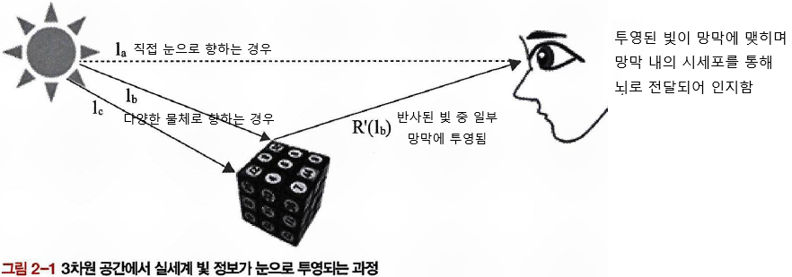

# Chapter 02: 디지털 영상의 취득과 저장 - 작성자: 한지윤

<aside>
💡

### 학습목표

- 영상이 형성되는 과정과 인간이 인식하는 과정을 이해한다.
- 빛과 색의 개념을 이해한다.
- 영상 데이터 표현의 개념을 이해한다.
</aside>

# 📂 2-1. 영상의 인식

## 🔎 1. 영상

<aside>

**일반적인 영상**

- **가시광선을 센싱**하여 자연 세계의 광학 현상을 **2차원 이상의 데이터**로 표현하는 것
- 이러한 영상은 1차원 또는 2차원 배열의 형태로 저장 및 표현함

**더 넓은 의미의 영상**

- 가시광선 영역 외의 범위를 센싱하거나 컴퓨터 그래픽을 이용하여 생성한 것
- 3D 데이터와 같은 다차원 영상으로 확장 가능
- 예시
    - X-ray: 가시광선 보다 높은 주파수 영역을 센싱
    - 적외선 영상: 가시광선보다 낮은 주파수 영역을 센싱
    - 3D 홀로그램 영상
</aside>

**🟩 3차원 공간에서 반사된 빛이 눈의 망막으로 투영되는 과정**



- 인간은 **눈으로 직접 들어오는 광원($l_a$)**을 **주변 밝기**로 인지함

> **💡 ∴ 일반적인 디지털 영상은 인간의 시각 모델을 흉내낸 것으로 볼 수 있습니다**
> 
- 광학 렌즈를 통해 모인 빛이 `CCD`(Charge-Coupled-Device) 혹은 `CMOS`(Complementary Metal-Oxide-Semiconductor)와 같은 카메라 내부의 영상 센서를 통해 에너지 크기에 따른 전기적 신호로 변환되면 전기적 처리를 거쳐 디지털 영상이 생성됩니다.
- CCD / CMOS
    
    출처: [https://www.baslerweb.com/ko-kr/learning/ccd-sensors](https://www.baslerweb.com/ko-kr/learning/ccd-sensors)
    
    <aside>
    
    **📌 CCD(Charge-Coupled-Device)**
    
    
    
    CCD 이미지 센서
    
    - CCD 이미지 센서는 사진, 비디오 감시, 의료 기술 및 기타 어플리케이션에서 오랫동안 사용되어 왔습니다. 
    광학 신호를 전자 신호로 변환하고 고해상도와 색 심도를 갖춘 고품질 이미지를 제공할 수 있습니다.
    
    
    
    CCD 방식
    
    - 디지털 카메라의 CCD(전하 결합 소자) 센서는 입사된 빛을 전자 신호로 변환합니다. 
    CCD 기술은 내부 광전 효과를 기반으로 합니다. 빛이 입사되면 반도체 층에서 전자가 방출되어 전도 대역으로 전달됩니다. 그 결과 생성된 전하를 행 단위 또는 열 단위로 판독하기 전에 먼저 전위라는 곳에서 수집합니다. 전하가 한 전위 우물에서 다른 전위 우물로 이동합니다. 신호는 라인 끝에서 증폭됩니다. 이 아날로그 전압은 디지털 값으로 변환됩니다. 수집된 모든 데이터는 원시 이미지 데이터(즉, 추가 처리 없이 센서가 제공하는 데이터)를 형성합니다.
    
    </aside>
    
    <aside>
    
    **📌 CMOS(**Complementary Metal-Oxide-Semiconductor**)**
    
    
    
    CMOS 센서
    
    
    
    - CMOS 센서(Complementary Metal-Oxide Semiconductor)는 디지털카메라 및 기타 이미지 촬영 장치에 사용됩니다. 빛을 전기 신호로 변환하는 작은 포토센서 매트릭스로 구성되어 있습니다. CMOS 이미지 센서의 각 감광 셀에는 자체 전하 증폭기가 있습니다. 이 기술을 통해 센서의 데이터 전송 속도가 훨씬 빨라지고 카메라의 최대 프레임 속도도 증가합니다.
    - 과거에는 CMOS 센서가 감광 영역의 제한으로 인해 감도가 낮았지만, 마이크로렌즈 어레이가 구현된 오늘날에는 더 이상 그렇지 않습니다.
    
    </aside>
    

## 🔎 2. 인식

**🟩 인간이 인지하는 시각의 단계**

**감각 단계**

- 외부의 빛이 눈의 렌즈를 통하여 망막의 신경세포에서 전기적 신호로 변환되고 신경계를 통하여 뇌로 보내지는 단계

**선택 단계**

- 보고자하는 대상을 분리하는 과정

**지각 단계**

- 기억 데이터를 근거로 대상을 이해하여 지각하는 과정


디지털 영상처리도 이와 유사한 과정을 거치게 된다.

표- 디지털 영상처리와 인간 인식의 대응 관계

| 인간의 단계 | 영상처리 단계 |
| --- | --- |
| 감각 단계 | 저수준 영상처리 (low-level) |
| 선택 단계 | 중간 수준 영상처리 (middle-level) |
| 지각 단계 | 고수준 영상처리 (high-level) |

**저수준 영상처리(low-level image processing)**

- 입력 영상을 간단히 처리하는 과정
- 가장 낮은 수준의 영상 처리라는 의미로, 인간의 시각 프로세스에서 `감각 단계`와 유사

**중간 수준 영상처리(middle-level image processing)**

- 선택 단계와 유사
- 영상 분할(segmentation), 심볼 매핑(symbol mapping)과 같이 특별한 목적에 따라 영상을 분할 및 분류하는 단계를 포함

**고수준 영상처리(high-level image processing)**

- 영상을 해석하고 인지하는 기술
- 이 단계는 영상 처리와 인공지능이 연결되는 과정으로 고려되기도 함

---

# 📂 2-2. 취득과 표현

일반적인 디지털 영상은 2차원 함수인 $f(x, y)$로 표현할 수 있다

**공간 좌표(spatial coordinate)**

- 영상 평면(image plane)에서 x와 y는 공간 좌표를 의미

**영상의 밝기(intensity)**

- 임의의 점 (x,y)에 대한 f의 크기는 영상의 밝기를 의미

> **∴ (x, y)의 위치값**과 **f의 크기값**이 **모두 유한**하고 **이산적인 값**일 때 **디지털 영상으로 정의**할 수 있다.
> 

## 🔎 1. 디지털 영상의 취득


디지털 영상의 취득과정은 그림 2-4 같이 사물에 대한 영상을 취득하는 `영상 취득 단계` 와 취득 영상에 대해 샘플링과 양자화를 수행하는 `영상 디지털화 단계`로 나눌 수 있다

---

### 📌 영상 취득 단계

**영상 취득 단계에서 가장 중요한 요소**

- **광원:** 태양, 형광등, 적외선 등(빛을 내는 모든 것)
- **렌즈 + 셔터 + 이미지 센서**: 실제 장면을 전기 신호로 변환

**🟩 원근 투영 모델**

- 일반적인 영상처리 과정에서 **원근 투영(perspective projection)**으로 모델화된 **핀홀(pin-hole)** 카메라 모델을 많이 사용함

**영상이 형성되는 원리**

- 현실 세계의 3차원 좌표 ($X_w, Y_w, Z_W$)에 있는 점 $p$가 카메라를 통해 
**2차원 영상 평면 좌표$p'(x, y)$**로 투영됨


**🟩 수학적 관계식**

삼각비를 사용하여 다음과 같이 표현됩니다.


$$
x = \frac{-fX_c}{Z_c-f},\quad y = \frac{-fY_c}{Z_c-f}
$$

- $f$는 초점 거리(focal length)
- $X_c, Y_c, Z_c$는 카메라 기준의 3D 좌표

> 카메라가 한개만 있을 경우 3차원 공간의 위치(거리)를 알 수 없습니다!
인간의 눈이 두개인 이유와 같지요
> 

**🟩 스테레오 정합을 통한 거리 계산 공식** 

- 영상 취득 단계 모델 취합
    
    
    


- $b$: 두 카메라 간 거리(베이스 라인)
- $x_L, x_R$: 왼쪽/오른쪽 카메라에서의 x좌표 차이

이러한 두 점이 3차원 공간상에서 같은 점에 해당하는 것을 찾는 과정을 `정합(매칭)`이라고 함

$$
X = \frac{bx_L}{x_L-x_R}, Z = \frac{bf}{x_L-x_R}
$$

삼각형의 비례 관계나 베이스라인을 포함한 벡터 관계식을 통하여 도출 할 수 있다.

위 식을 계산할 때는 모든 변수의 단위가 일치해야한다.

- 영상 좌표에서 미터 단위로 변환
    
    ### ⚡ 영상 좌표란?
    
    - 영상 좌표계는 Pixel 단위
    - (x,y) = (100,200)은 100번째 열, 200번째 행의 픽셀을 의미함
    - 이는 물리적 크기를 나타내지 않음
    
    ### ⚡ 실세계 단위로 바꾸려면?
    
    - 실제 거리 단위로 바꾸려면 화소(Pixel)가 차지하는 실제 크기를 알아야 함
        
        $$
        X = x \cdot s_x, \quad Y = y \cdot s_y
        $$
        
    - $x, y$:  영상상의 픽셀 좌표
    - $s_x,s_y$: 각 축 방향의 **화소 당 실제 크기 (예: mm/pixel, m/pixel)**
    - $X,Y$: 실세계 거리 (미터 등)
    
    → 영상 좌표 * 화소 크기 = 실세계 좌표
    
    ### ⚡ 예제
    
    어떤 카메라 센서가 다음과 같다
    
    - 해상도: 1920 × 1080 (픽셀)
    - 센서 크기: 가로 6.4 mm, 세로 3.6 mm
    
    그러면,
    
    - 가로 1픽셀의 크기: $s_x = \frac{6.4 \text{ mm}}{1920} ≈ 0.0033 \text{ mm}$
    - 세로 1픽셀의 크기: $s_y = \frac{3.6 \text{ mm}}{1080} ≈ 0.0033 \text{ mm}$
    
    만약 영상 좌표 $(x,y)=(1000,500)$이라면,
    
    - $X = 1000 \cdot 0.0033 = 3.3 \text{ mm}$
    - $Y = 500 \cdot 0.0033 = 1.65 \text{ mm}$

**🟩 조리개** 


- 빛의 양을 조절하는 장치
- 인간의 동공과 유사한 역할을 함
    - 어두운 곳 → 크게 열어서 빛을 많이 받음
    - 밝은 곳 → 작게 줄여 빛을 적게 받음
- 단위: $f$(f-stop)
    - 값 大 → 조리개 구멍 작아짐 → 빛 小 (어두운 영상)
    - 값 小 → 조리개 구멍 커짐 → 빛 大 **(**밝은 영상)

**🟩 셔터**

- 빛이 들어오는 시간을 조절
- 셔터가 열리고 닫히는 시간 → **셔터 속도**
    - 빠른 셔터 속도 → 빛이 짧게 들어옴 → 움직임이 멈춘 듯한 영상
    - 느린 셔터 속도 → 빛이 오래들어옴 → 흐릿하고 잔상이 남는 영상(블러링)

---

### 📌 영상 디지털화 단계

- 센서에서 들어온 빛 신호(아날로그) → 디지털 값으로 변환하는 과정

이러한 샘플링은 두가지로 나눌 수 있다.

1. **샘플링(Sampling)**
공간적 간격을 정해 점을 추출
2. **양자화(Quantization)**
추출된 값을 정수로 변환


아날로그 신호를 샘플링하고 양자화하는 과정

**🟩 샘플링 (Sampling)**

- **공간 샘플링**
한순간에 취득된 영상을 공간 간격에 따라 데이터로 표본화하는 과정
- **시간 샘플링**
정지 영상의 노출 시간과 관련이 있고, 동영상은 시간축에서의 샘플링 간격과 관련이 있음
- 일반적인 디지털 광학 카메라는 **이미지 센서의 화소수**에 따라 **샘플링의 정확도**가 결정됨
- 샘플링 간격 小 (픽셀 수 大) → 고해상도
- 너무 많이 하면 데이터 용량 大, 비용 大

- **나이키스트 샘플링(nyquist sampling)**
    - 최대 주파수의 2배로 샘플링을 하면 원신호를 완전히 표현할 수 있다

(이 샘플링은 제가 이해를 잘 못해서 추후 정리해오겠습니다)


**🟩 양자화(Quantization)**

- 샘플된 값(연속된 밝기 값)을 한정된 단계 값으로 변환


- 3비트 → 8단계
- 2비트 → 4단계
- 8비트 → 256단계(흑백 영상의 기본)
- 최근은 10비트 이상도 사용

> 비트 수 大 → 세빌한 밝기 표현 가능 
But, 처리속도 & 저장 용량 大
> 

**예시:**


---

## 🔎 2. 디지털 영상의 표현

🟩 **디지털 영상이란?**

- 디지털 취득 장치 → 샘플링 & 양자화 → 디지털 영상 생성
- 즉 영상은 **이산적인 값들의 배열**로 표현됨

🟩 **디지털 영상의 해상도**


- 2차원 평면에 나타 낼 때 $M×N$ 크기의 격자로 구성
    - M = 가로 방향 픽셀 수
    - N = 세로 방향 픽셀 수
- 따라서 영상의 해상도  = $M×N$
    - **Pixel**
    디지털 영상의 가장 작은 단위,
    하나의 밝기 값 또는 색상 값을 가짐

---

# 📂 2-3. 빛과 색

## 🔎 1. 빛과 색의 관계

🟩 **가시광선**


- 빛 = 전자기파의 일종
- 가시광선 = 인간이 볼 수 있는 파장 범위를 의미함
- 400~500nm: Blue (짧은 파장)
- 500~600nm: Green
- 600~700nm: Red (긴 파장)

🟩 **빛과 색의 감지**


- 최종 적으로 인간의 눈에 들어오는 빛:

$$
I(λ) = L(λ)×R(λ)
$$

- **광원(Light Source, $L(λ)$)**
    - 태양, 전등 등 빛의 근원
- **물체(Object, $R(λ)$)**
    - 빛을 반사하거나 흡수하는 대상
- **눈(Eye, $I(λ)$)**
    - 들어온 빛을 감지하는 수용체

---

## 🔎 2. 색의 3속성

🟩 **색에 대한 정량화**

다양한 출력 장치에서 동일한 색으로 표현하기 위해 **임의의 색에 대한 기준**을 정의해야 했습니다.
이러한 이유로 **색에 대한 정량화**가 필요하였고, **색의 3가지 속성을 이용한 색 공간(Color Space)**에 색을 표현하게 되었습니다.

**🟩 색의 3속성**


- **밝기 (Brightness)**
    - 빛의 세기, 즉 밝고 어두운 정도
    - 축 방향(a축)으로 표현
- **색상 (Hue)**
    - 빨강, 초록, 파랑처럼 서로 다른 색의 종류
    - 원판 둘레(b 원판) 위의 위치로 표현
- **채도 (Saturation)**
    - 색의 선명함, 탁하거나 맑은 정도
    - 중심에서 멀어질수록 채도가 커짐
    

🟩 **CIE의 표준 색 공간**

- 국제조명위원회(CIE)는 전 세계적으로 색을 동일하게 표현하기 위해 **표준화된 색 공간**을 제안함
- 인간의 눈 반응을 실험하여 **3자극치(Tristimulus values)**를 X, Y, Z로 정의
    
    
    

$$
X = \int_0^\infty I(\lambda)\,\bar{x}(\lambda)\,d\lambda \\Y = \int_0^\infty I(\lambda)\,\bar{y}(\lambda)\,d\lambda \\Z = \int_0^\infty I(\lambda)\,\bar{z}(\lambda)\,d\lambda
$$

$$
x = \frac{X}{X+Y+Z} \\y = \frac{Y}{X+Y+Z} \\z = \frac{Z}{X+Y+Z}
$$

- 빛의 스펙트럼이 인간 눈에 어떻게 보이는지를 숫자로 변환한 값
- X, Y, Z 세 값만 있으면 스펙트럼 전체를 다 저장하지 않고 색을 완전히 표현할 수 있음
    - x+y+z = 1

🟩 **활용**

- **CIE XYZ 색 공간**: 삼자극치를 기반으로 정의된 최초의 국제 표준 색 공간
- 이후 변환 → **CIE xyY 색 공간** (밝기 분리)
- 다시 변환 → **sRGB, Adobe RGB, Lab** 등 디지털 영상에서 쓰는 색 공간

👉 우리가 보는 모니터, 카메라, 프린터 색 표현은 모두 결국 **삼자극치**에서 출발합니다.

---

# 📂 2-4. 컬러 모델

 근데…. 실제로는 디지털 영상의 취득 및 표현은 **RGB 공간**을 가장 많이 사용함

## 🔎 1. 개념

색은 근본적으로 인간의 뇌에서 인지하는 개념이므로, 수학적으로 표현하는 것 자체가 불가능
가능하면 인간의 시각 특성과 유사하거나 응용 장치에서 처리하는 방식에 따라 색을 사용함

- RGB: 컬러모니터, TV
- HSI: 인간의 색체 지각 능력과 유사하게 적용
- CMYK: 인쇄
- YCbCr: 영상 압축 분야

---

## 🔎 2. RGB 컬러 모델

🟩 **RGB 컬러 모델이란?**


- R(빨강), G(초록), B(파랑) 세 가지 빛의 삼원색으로 색을 표현하는 모델
- (R,G,B) 이렇게 값을 가지게 됨
- (0,0,0) = Black
- (1,1,1) = White

RGB 컬러 모델에서 영상의 채널별 결합과 분해


Gray Sacale((R+G+B)/3)


R


G


B

🟩 **RGB 모델의 한계**

- 채널 간 상관도가 높음 → 데이터 중복 발생
    - 실제로 위의 R,G,B 영상의 사이에는 상관도가 매우 높음
- RGB만으로 모든 색을 표현할 수 없음

🟩 비트 심도(Bit Depth)

- 한 채널을 표현하는 비트 수 → 영상의 화소 깊이를 결정
- 예시
    - 8비트는 1채널 당 256단계의 색 표현 가능
    - 3채널이 결합된 영상은 24비트
- 최근에는 10비트, 12비트, 16비트 컬러 채널까지 확장 연구 진행 중

---

## 🔎 3. YCbCr 컬러 모델

흑백 TV → 컬러 TV 전환될 때 호환성을 위해 개발됨

- 인간의 눈은 밝기(휘도, Luminance, Y)에 더 민감하고, 색(색차, Chrominance, Cb, Cr)에는 덜 민감함
- 이런 시각적 특성을 고려해 만든 컬러 표현 방식
    - Y: 휘도
    - Cb: 휘도와 파란색 차이
    - Cr: 휘도와 빨간색 차이


상: RGB, 하: YCbCr

→ RGB 평면 모델에 비해 컬러 성분 간의 정보 중복성이 적음을 알 수 있음

🟩 RGB ↔ YCbCr 변환식

- RGB→YCbCr
    - RGB 성분에 의존적인 컬러 모델임
    - 계수는 3자극치에 의해 도출됨

$$
Y=0.299R+0.587G+0.114B \\
Cb=−0.169R−0.331G+0.500B
\\ Cr=0.500R−0.419G−0.081B
$$

- YCbCr→RGB

$$
R=1.000Y+1.402Cr\\
G=1.000Y−0.714Cr−0.344Cb\\
B=1.000Y+1.772Cb
$$

하지만 계산식이 모두 부동 소수점 연산으로 되어 있어 기계마다 정확도가 달라질 수 있는 문제가 존재함

🟩 **장점**

- 영상 압축(JPEG, MPEG 등)에서 효율적
    - 눈은 밝기(Y)에 민감 → 더 높은 해상도로 저장
    - 색차(Cb, Cr)는 해상도를 줄여도 화질에 큰 영향 없음
- **용량 절감+시각적 품질 유지** 가능

---

## 🔎 4. CMY 컬러 모델

- **C(Cyan, 청록)**, **M(Magenta, 자홍)**, **Y(Yellow, 노랑)** 3원색으로 색을 표현
- RGB 모델의 **보색 관계**에 해당
    - Cyan = Red의 보색
    - Magenta = Green의 보색
    - Yellow = Blue의 보색

🟩 **CMY ↔ RGB 변환식**

- 모델간의 변환이 쉬움

$$
C = 1-R \\ M = 1-G \\ Y = 1-B
$$

$$
R = 1-C \\ G = 1-M \\ B = 1-Y
$$

🟩 **CMY의 활용**

- CMY 컬러 모델은 컬러프린터, 복사기와 같은 장치에서 주로 사용
- CMY 컬러 모델에 검은색(K, Black)을 더한 것을 `CMYK 컬러 모델`이라고 함
    - CMY 만으로 검정 표현시 완벽한 검정이 안나오고 색이 탁함
    - 검정 채널 따로쓰는게 더 선명하고 비용도 절감됨

---

## 🔎 5. HSI 컬러 모델

- 인간의 인지적 속성을 기반으로 개발


- H: 색상(Hue)
    - 각도로 표현
- S: 채도(Saturation)
    - 반지름에 해당
- I: 명도(Intensity)
    - 수직 축

🟩 RGB ↔ HSI 변환식

- HSI, 코사인 함수
    
    
    
    HSI 모델
    
    
    
    Cos 함수
    
    
    

- HSI → RGB

<aside>

- 해당 수식을 이해하기 위한 정리
    - $\frac{1}{3}$을 하는 이유는 정규화때문 (0-1 사이의 값을 가져야함)
    - 60º에서 H를 빼는 이유는 색 성분이 어느쪽에 더 가까운지 알기 위함입니다.
    0도~120도는 초록색과 빨간색 사이의 영역이기 때문에 이 중, 어떤 색 성분이 가까운지 알기 위해 이러한 계산을 합니다.
    - 1-S를 하는 이유는 상대적으로 색 성분이 약하기 때문에, 해당 구간에서 B의 기여도가 작다는 점을 반영하고 계산을 단순화 합니다.
- 0° < H ≤ 120°일 때
    - 주로 빨간색~초록색에 해당하는 영역
        
        $$
        R = \frac{1}{3}\left(1 + \frac{S\cos(H)}{\cos(60°-H)}\right) \\
        $$
        
        $$
        G = 1 - (R + B)
        $$
        
        $$
        B = \frac{1}{3}(1 - S)
        $$
        
- 120° < H ≤ 240°일 때
    - 주로 초록색~파란색에 해당하는 영역

$$
H = H - 120
$$

$$
R = \frac{1}{3}(1 - S)
$$

$$
G = \frac{1}{3}\left(1 + \frac{S\cos(H)}{\cos(60°-H)}\right)
$$

$$
B = 1 - (R + G)
$$

- 240° < H ≤ 360°일 때
    - 주로 파란색~빨간색에 해당하는 영역

$$
H = H - 240
$$

$$
R = 1 - (G + B)
$$

$$
G = \frac{1}{3}(1 - S)
$$

$$
B = \frac{1}{3}\left(1 + \frac{S\cos(H)}{\cos(60°-H)}\right)
$$

</aside>

- RGB → HSI 변환식

$$
H=\cos^{-1}\frac{0.5\times\{(R-G)+(R-B)\}}{\sqrt{(R-G)^2+(R-B)(G-B)}}
$$

$$
S=1-\frac{3}{R+G+B}\min(R,G,B)
$$

$$
I = \frac{R+G+B}{3}
$$

---

# 📂 2-5. 데이터 포맷

🟩 **디지털 영상의 구조**


- 헤더(Header)
    - 영상의 형식, 크기, 해상도, 파일 크기 등
    - 부가 정보 저장
- 영상 데이터부
    - 실제 픽셀(pixel)값 저장

영상 파일을 열 때 헤더 정보를 먼저 읽고, 그 다음 픽셀 데이터를 불러옵니다.

→ 헤더가 손상되면 영상이 열리지 않음

**🟩 픽셀과 해상도**


- 픽셀
    - 디지털 영상의 최소 단위 (가로 x 세로)
- 공간 해상도(spatial resolution)
    - 영상에 포함된 전체 픽셀 수
    - 예: 1920 * 1080 = 2,073,600 픽셀 (Full HD)
- 해상도가 높을수록 더 선명한 영상 표현 가능

🟩 **밝기 해상도(Intensity Resolution)**

- 픽셀의 위치뿐 아니라 픽셀 밝기 값이 얼마나 정밀하게 표현되었는지도 중요
- 이걸 밝기 해상도(Intensity Resolution) 라고 부름
- 예: 8비트 영상 → 0-255 단계로 밝기 표현

🟩 **시간 해상도(Temporal Resolution)**

- 동영상에서는 초당 몇 개의 프레임을 표현하는지도 중요함
- 이를 **프레임률(Frame Rate)** 또는 **시간 해상도**라고 함
- 예: 30FPS, 60FPS 등

> 즉, 디지털 영상의 품질은 공간해상도 + 밝기 해상도 + 시간 해상도 세가지로 결정됨!
> 

---

## 🔎 1. RAW 데이터 포맷

🟩 **정의**


- RAW 포맷은 영상의 픽셀값만 단순히 기록한 파일 형식
- 헤더 정보(파일 크기, 해상도 등)가 포함되지 않음
- 따라서 영상 데이터를 끝까지 읽어야 가로x세로 크기를 알 수 있음

**🟩 특징**

- 구조
    - 영상 데이터만 존재 (헤더 X)
    - 픽셀 밝기 값(흑백 신호) 또는 RGB 순서로 저장
    - 저장 방식에 따라 채널을 순서대로 나열하거나, 분리해서 저장하기도 함
- 저장 방식
    - 일반적으로 레스터 스캔(raster scan)방식 사용
    → 왼쪽 위 픽셀부터 오른쪽으로, 다시 줄 바꿔서 순차적으로 저장
- 제한점
    - 크기, 해상도, 색상 형식을 알 수 없음
    - 따라서 실제 활용 시에는 영상 데이터 앞에 헤더 정보를 붙여 사용함

---

## 🔎 2. 디지털 영상의 데이터 포맷


- JPG
    - 정지 영상에 대한 압축 표준
    - 영상의 색상, 해상도 등을 알 수 있는 정보가 헤더 정보에 포함됨
    - 예측 및 엔트로피 코딩을 통하여 영상 데이터를 압축하여 저장함
- BMP
    - 영상을 저장 및 출력할 때 각각의 픽셀 밝깃값을 나열한 데이터 포맷이다
    - 비트맵방식
    - 압축을 사용하지 않는 무손실 포맷
    - 주로 메모리에 저장된 데이터를 그대로 출력하거나 저장할 때 사용
    - 픽셀을 2차원 정렬하여 그림으로 표현하면 각각의 픽셀은 숫자로 표현되는 고유의 색을 가짐
    - 8비트 BMP포맷을 가진 디지털 영상은 하나의 픽셀을 표현하기위해 8자리 이진수를 사용함

---

## 🔎 3. BMP 포맷


🟩 **형태**

- 헤더 부분
    - `BITMAPFILEHEADER`
        - BMP 파일 포맷임을 명시
        - 헤더 파일 크기를 포함하는 전체 영상의 크기 등
    - `BITMAPINFOHEADER`
        - 영상 데이터를 저장하는 부분
        - 영상 데이터 해상도
        - 컬러 비트 심도
        - 영상 데이터 크기 등
    - `RGBQUAD`
        - 색상 테이블을 저장하는 부분
        - 256개 이하의 색상을 사용한다면 별도의 색상테이블에 배열 형태로 색을 저장함
- 영상 데이터 부분
    - RGB 컬러로 구성됨
    - 영상의 상하가 반대로 저장됨

**🟩 `BITMAPFILEHEADER`구조체**

```cpp
typedef struct tagBITMAPFILEHEADER {
        WORD    bfType;         // 비트맵 파일 지시자, 값 = BM
                                // 2바이트 unsigned short형
        DWORD   bfSize;         // BMP 파일 크기 바이트 단위로 표현
																// 4바이트 unsigned long형
        WORD    bfReserved1;    // 나중에 사용하기 위해 예약됨, 값 = 0
        WORD    bfReserved2;             
        DWORD   bfOffBits;      // 시작부터 실제 픽셀정보 배열까지 오프셋을 바이트 단위로 표현
} BITMAPFILEHEADER, FAR *LPBITMAPFILEHEADER, *PBITMAPFILEHEADER;
```

**🟩 `BITMAPINFOHEADER`구조체**

```cpp
typedef struct tagBITMAPINFOHEADER{
        DWORD      biSize;              // 구조체 크기, 40 byte
        LONG       biWidth;             // 가로 픽셀 수
        LONG       biHeight;            // 세로 픽셀 수, 양수면 상하 뒤집힘, 음수면 일반적인 상태
        WORD       biPlanes;            // 비트맵 화면을 출력할 때 필요함, 값 = 1
        WORD       biBitCount;          // 픽셀 하나를 표현하기 위해 필요한 비트 수
        DWORD      biCompression;       // 압축 타입 BMP는 무압축이므로 0임
        DWORD      biSizeImage;         // 영상의 크기를 byte로 표현, 픽셀 데이터 저장시 필요한 메모리 공간
        LONG       biXPelsPerMeter;     // 영상의 가로 해상도, 미터당 가로 픽셀 수
        LONG       biYPelsPerMeter;     // 영상의 세로 해상도, 미터당 세로 픽셀 수
        DWORD      biClrUsed;           // 실제 사용되는 컬러 수, 일반적으로 0
        DWORD      biClrImportant;      // 주로 사용하는 컬러 수, 값이 0이면 모든 색상을 나타냄
} BITMAPINFOHEADER, FAR *LPBITMAPINFOHEADER, *PBITMAPINFOHEADER;
```

**🟩** `RGBQUAD`**구조체**

```cpp
typedef struct tagRGBQUAD { // 미리 정해진 색상의 집합, 256색 이하 영상을 표현할 때 사용
        BYTE    rgbBlue;
        BYTE    rgbGreen;
        BYTE    rgbRed;
        BYTE    rgbReserved;
} RGBQUAD;  // 색상 표현이 [B G R]임을 주의
```

**🟩 Color/index 배열**

실제 영상의 픽셀 데이터를 저장하는 배열

`BITMAPINFOHEADER` 의 `biHeight` 값이 대부분 양수로 저장되므로 비트맵은 상하가 뒤집힌 상태로 저장됨


`RGBQUAD` 구조체에서 보았듯, 색상 테이블이 없는 트루컬러 비트맵은 픽셀당 3바이트를 이용하여 픽셀정보를 저장함

각 픽셀은 Blue, Green, Red 순서로 나타냄


- 신호대 잡음비(SNR; Signal-to-Noise Ratio)
    
    ### 🛸 신호대 잡음비란?
    
    - 정의: 신호의 크기(세기)에 비해 잡음이 얼마나 작은가를 나타내는 비율
    - 신호의 품질을 평가할 때 꼭 쓰이는 지표
        
        $$
        \text{SNR} = \frac{\text{Signal Power}}{\text{Noise Power}}
        $$
        
    - 보통 데시벨(dB)단위로 표현함
        
        $$
        \text{SNR(dB)} = 10 \cdot \log_{10} \left( \frac{\text{Signal Power}}{\text{Noise Power}} \right)
        $$
        
    
    ### 🛸 왜 중요한가요?
    
    - 신호가 크고 잡음이 작으면 → 뚜렷하고 선명한 정보
    - 잡음이 크면 → 흐릿하거나 왜곡된 정보