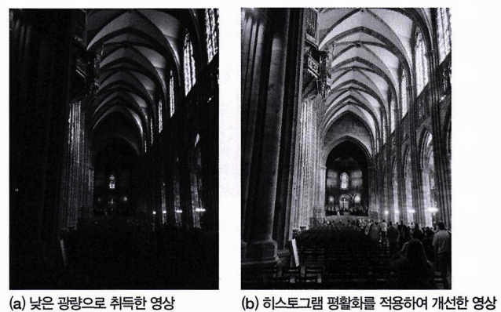

# Chapter 03: 화질 개선 - 작성자: 고형주

<aside>
💡

### 학습목표

- 영상 화질 개선과 복원의 개념을 이해한다.
- 디지털 영상의 화질 개선 평가 방법을 이해한다.
- 히스토그램 영상 개선 방법을 이해한다.
</aside>

<aside>
🗒️

### 프리뷰

**영상 개선은 주어진 영상을 다양한 응용 분야에 적합한 형태로 개선하는 것**이다. 다양한 영상처리 응용의 목적에 부합하도록 입력된 영상의 임의의 특징을 강조 또는 감쇄하는 과정을 포함한다. 예를 들어, 영상 개선의 목적이 인간에게 더 나은 영상을 보여 주는 것이라면 일반적으로 인간이 주관적으로 화질이 좋다고 느끼는 방향으로 신호를 변환해야 한다. 즉, **원래의 “신호 값을 얼마나 잘 표현하는가”보다 “더 많은 사람이 주관적으로 더 좋은 화질”이라고 느끼도록 하는 것이 화질 개선의 목적**이다.
하지만 화질 개선이 어떤 시스템의 중간 과정으로. 이후의 과정을 위해 더 효율적으로 이용되도록 하는 방식일 수도 있다. 예를 들어, 문자 인식 시스템에서 인식률이 향상되도록 영상을 가공하는 것이 화질 개선의 목적일 수도 았다.

</aside>

---

# 목차

**73 - 98 (26페이지)**

---

<aside>

# 영상 개선과 복원

</aside>

## 1. 영상 개선

### 영상 개선이란?

<aside>

**영상 개선은 주어진 영상을 다양한 응용 분야에 적합한 형태로 개선하는 것**이다. 다양한 영상처리 응용의 목적에 부합하도록 입력된 영상의 임의의 특징을 강조 또는 감쇄하는 과정을 포함한다. “원래의 신호 값을 얼마나 잘 표현하는가”보다는 **“더 많은 사람이 주관적으로 더 좋은 화질이라고 느끼도록 하는 것”이 화질 개선의 목적**이다.

</aside>

### 영상 개선의 일반적인 예

- 영상 내 특정 영역의 대비를 강하게 하는 방법
- 영상의 전체적인 명암을 조절하는 방법
- 영상의 특정 주파수 대역을 제거하는 방법
- 등등

이러한 영상 개선을 통하여 관찰자가 영상의 해석을 용이하게 하거나 영상 내 특정 정보를 인지할 수 있도록 할 수 있다.

아래 그림은 간단한 영상 개선의 예이다.




(a)는 어두운 실내에서 취득한 영상이다. **광량이 충분히 확보되지 않아서 어두운 영역에 있는 객체의 형태를 구분하기 힘들다.**

이 영상에서 상대적으로 더 어두운 영역은 인간이 시각적으로 객체를 구분할 수 없는 수준임을 알 수 있다. 어두운 영역에서 인지적으로 객체를 뚜렷하게 구분하지 못하는 이유는 해당 영역에 명암의 차이가 없기 때문이 아니라, **인간의 시각 시스템 특성상 매우 밝거나 매우 어두운 영역의 명암 대비에 상대적으로 둔감**하기 때문이다.

즉, (a)의 왼쪽 가장자리 영역처럼 어두운 영역에는 명암 대비가 있지만, 눈으로 보았을 때 쉽게 구분되지 않는다. 이러한 **어두운 영역의 객체를 구분할 필요가 있다면, 다양한 영상 개선 방법을 적용할 수 있다.**

(b)는 (a) 영상 전체에 **히스토그램 평활화(histogram equalization)를 적용**한 영상이다.

이러한 영상 개선 알고리즘을 적용하여 어두운 영역의 대비가 높아지는 효과를 얻으면 해당 영역의 가시성을 확보할 수 있다.


---

## 2. 영상 복원

### 영상 복원이란?

<aside>

**영상 복원은 영상 개선과 달리 열화된 영상의 원인을 파악하고 원본 영상을 복원하는 것**이다.

</aside>

영상은 다양한 원인으로 열화될 수 있는데, **다양한 열화 형태를 모델링하여 제거하는 것이 영상 복원의 일반적인 목적**이다. 열화를 제거하기 위해서는 잡음 제거, 공간 필터링, 움직임 보정에 기반한 처리 등 다양한 방법을 사용할 수 있다.

다음 그림은 가우시안 노이즈가 있는 영상에 영상 복원을 적용한 예이다.


(a)는 **가우시안 노이즈에 의해 열화되어 영상 내 객체의 표면이 매끄럽지 않은 것을 확인**할 수 있다.

(b)는 이 노이즈를 없애기 위해 가우시안 필터로 영상 복원을 수행한 결과이다.


**가우시안 노이즈 대부분이 제거되어 화질이 좀 더 깨끗해졌음**을 알 수 있다.

영상 복원을 영상 개선과 혼동하지 말아야 한다. **영상 복원은 원본 영상으로 신호를 복원하는 것을 목적으로 하는데 이것이 영상 개선과는 응용에 따라 다를 수 있다.**

영상 개선 및 복원의 성능을 측정할 때는 주관적 화질 또는 객관적 화질을 평가할 수 있다.

일반적으로 **주관적 화질은 인간의 주관적 관점으로 느끼는 화질**을 말하고, **객관적 화질은 기준 영상(또는 원본 영상) 대비 가공된 영상의 수치적 화질**을 말한다. 주관적 화질을 가장 제대로 평가하는 방법은 인간을 이용한 주관적 평가이다. 하지만 최근에는 주관적 화질을 객관적 방법으로 평가하는 연구도 진행되고 있다. 객관적 화질은 객관적 방법으로 평가한다.

| 화질 종류   | 평가 방법                 |
| ----------- | ------------------------- |
| 주관적 화질 | 인간을 이용한 주관적 평가 |
| 객관적 화질 | 객관적 방법으로 평가      |

---

<aside>

# 화질

</aside>

**화질에 대한 평가는 영상의 객관적 속성과 인간의 정신 물리학적 인지 과정이 함께 작용한 결과**이다. 영상의 객관적 속성에 영향을 주는 요소는 영상의 취득 및 처리 과정에서 발생하는 영상 열화, 전송 과정에서 발생하는 데이터 손실 등이다. **주관적 속성은 인간의 경험, 생물학적 특성, 감정 등 매우 다양하고 복잡한 요소에 의하여 영향을 받는다.** 결과적으로 **화질 지표는 크게 객관적 화질과 주관적 화질로 분류**한다.

---

## 1. 객관적 화질과 주관적 화질

### 객관적 화질

객관적 화질은 일반적으로 원본과의 차이를 수치적으로 평가한다.

**객관적 화질의 평가 방법**

- MAD(Mean Absolute Difference)
- MSE(Mean Squared Error)
- SSE(Sum of Squared Error)
- PSNR(Peak Signal to Noise Ratio)
- etc.

### 주관적 화질

주관적 화질은 인간이 느끼는 화질이다. 주관적 화질에 대한 가장 정확한 평가는 영상을 피실험자에게 실제로 보여 준 뒤 각 피실험자가 주관적으로 느끼는 화질을 평가하고 측정하는 방법이다

**주관적 화질의 평가 방법**

- DSCQS(Stimulus Continuous Quality Scale)
- DSIS(Double Stimulus Impairment Scale)
- etc.

**객관적 방법으로 주관적 화질과 상관성이 높은 객관적 화질을 평가하는 방법**

SSIM 화질 평가 방법은 객관적 방법으로 주관적 화질을 평가하는 대표적인 방법으로, 주관적 화질과 상관성이 높은 평가 방법이다.

---

## 2. 화질 평가 방법

**객관적 화질 평가는 열화된 영상의 원본 영상 대비 열화 정도를 수치로 계산하여 측정**한다. 객관적 화질 평가에서 가장 널리 사용하는 화질 척도는 **최대 신호 대 왜곡 비율**을 나타내는 **PSNR**이다.

신호의 PSNR은 다음과 같은 식으로 정의한다.

$$
\text{PSNR} = 10 \cdot \log_{10} \left( \frac{MAX^2}{\text{MSE}} \right)


$$

**MAX값은 입력 신호의 최댓값**을 의미한다. 만약 8비트 심도를 가진 영상이라면 $2^8-1=255$가된다.

**MSE(Mean Squared Error)는 원본 신호와 비교 대상이 되는 신호 간 제곱 차의 평균**을 의미하며 다음 식과 같이 정의한다.

$$
\text{MSE} = \frac{1}{n} \sum_{j=1}^{n} \left( X_j - \hat{X}_j \right)^2
$$

PSNR의 단위는 데시벨(dB)이며, 값이 클수록 열화 정도가 작음을 의미한다. MSE가 0으로 열화가 없는 경우 PSNR의 값은 무한대이다.

MSE가 크다.

→ 원본 신호와 비교 대상이 되는 신호 간 제곱 차의 평균이 크다.

→ $\log_{10} \left( \frac{MAX^2}{\text{MSE}} \right)$
가 작다.

→ PSNR이 작다.

→ 열화 정도가 크다.

일반적으로 PSNR의 값이 크다는 것은 원본 영상과 비교했을 때 열화된 영상의 열화 정도가 작음(열화된 영상 내의 수학적인 에러 양이 적음)을 의미한다.

### **영상 신호의 원본 대비 PSNR값이 높을수록 화질이 좋다**

다음은 원본 영상 대비 열화가 있는 다양한 객관적 화질의 영상 예시이다.


열화된 영상인 (a), (b), (c)를 보면 PSNR의 값이 클수록 원본 영상에 가깝다는 것을 알 수 있다. 따라서 **영상 신호의 원본 대비 PSNR값이 높을수록 화질이 좋다**고 할 수 있다.

### 측정된 에러의 양이 적으므로 주관적 화질이 ‘좋다’라고 판단할 수 없다.

다음은 임의의 원본 영상, 두 열화 영상과 각 열화 영상의 원본 대비 PSNR값이다.


수학적으로 측정된 PSNR값에 의하여 (c)가 (b)보다 원본 영상에 더 가까운, 열화가 덜된 영상이라 할 수 있다. 그러나 해당 영상에서 여성의 얼굴 부분에 열화가 있는 (c)보다 (b) 영상이 PSNR값은 작지만 주관적 화질 관점에서는 더 낫다. 이처럼 **PSNR는 값이 클수록 화질이 좋고 계산이 간단하여 널리 사용되지만, 주관적 화질과 항상 일치하지 않는다.**

객관적 화질 측정 방법은 인간이 느끼는 주관적 화질을 완전히 대체할 수 없다. 열화의 발생 위치, 열화의 종류, 인간이 관심을 두는 영역(ROl: Region Of Interest) 등과 같은 다양한 요소가 주관적 화질에 영향을 미치기 때문이다. 그럼에도 이러한 **객관적 화질 평가가 널리 이용되는 것은 구현이 용이하고, 이후에 설명할 주관적 화질 측정에 비하여 적은 비용으로 측정할 수 있으며 일정 정도 수준에서 주관적 화질과 높은 상관도를 보이기 때문이다.**

## 주관적 화질

주관적 화질 측정 방법은 PSNR과 같은 객관적 화질 측정과 달리, **다양한 화질의 영상을 인간에게 직접 보여 준 뒤 실제로 느끼는 주관적 화질을 측정**하는 것이다. 이러한 주관적 화질 측정 방법을 사용하면 개념적으로 객관적 화질 측정보다 실제 화질을 정확하게 평가할 수 있다.

주관적 화질을 평가하는 방법에는 많은 종류가 있지만, 가장 많이 사용되는 것은 MOS(Mean Opinion Score) Test이다. **MOS Test는 객관성 유지를 위해 일정 수 이상의 비전문가로 구성된 평가단이 영상을 시청한 뒤 화질에 대한 주관적 평가를 한다.** 영상에 대한 취향, 객관적 척도 등이 모두 다른 평가자로부터 평가받으므로 평가 결과는 일정하지 않을 수 있다. 신뢰도가 높은 결과를 얻기 위해서는 많은 평가자가 평가하여야 통계적으로 의미 있는 결과를 얻을 수 있다.

주관적 화질 측정 방법은 정확한 측정 결과를 얻기 위해 많은 평가자가 필요하다. 객관적 화질 평가 방법보다 오랜 시간이 소요되며 반복적인 실험을 할 수 없는 어려움이 있다. 또한, 화질을 실시간으로 측정할 수 없는 것도 주관적 화질 평가의 단점 중 하나이다. 그럼에도 **주관적 화질을 측정하는 이유는 객관적 화질 평과 결과보다 높은 신뢰도를 보이기 때문이다.**

**MOS Test는 평가 결과의 객관성 유지를 위해 정해진 절차에 따라 평가하며 이를 위한 관련 표준이 있다.** 가장 많이 사용하는 것은 ITU-R BT.5OO-13 표준이다. 이 표준에서 제시하는 MOS Test 방법은 DSIS와 DSCQS이다.

**MOS Test에서 가장 널리 사용하는 방식은 평가 결과의 정확도 및 신뢰도가 좀 더 높은 DSCQS 방식**이다. 이 방식은 원본 영상과 평가 대상 영상을 무작위 순서로 피실험자에게 보여 준 뒤 영상에 대한 평가를 수행하는 방식으로 진행된다.


DSCQS 테스트의 진행 방법

구체적인 평가 방식은 한 쌍의 테스트 영상을 왼쪽 그림과 같이 일정한 시간 간격으로 보여 준다. 이때 서로 같거나 다른 화질의 영상 A와 B를 2회 보여 주면서 화질을 평가한다. 왼쪽에서 T1, T3는 영상 A와 B가 디스플레이되는 구간이다. T2는 두 영상이 디스플레이되는 구간을 구분하기 위한 것으로, 회색 화면이 디스플레이될 때 T2는 3초 정도의 시간 간격을 둔다.

두 영상에 대한 평가 결과는 영상 A. B가 두 번째 디스플레이되는 동안 수행되며, 오른쪽 그림의 예처럼 연속된 5개 등급 중 피실험자가 실제로 느낀 화질을 표시하는 형태로 이루어진다.


DSCQS 테스트 방식에 사용되는

연속 스케일 응답지

**👥 MOS (Mean Opinion Score) Test**

- 비전문가 평가단 구성
- 통계적 신뢰성 확보 필요
- 시간/비용 많이 소요

**🔬 ITU-R BT.500-13 표준**

- DSCQS: 연속 척도 평가 (0-100점)
- DSIS: 손상 척도 평가 (5단계)

| 구분 | 객관적 평가            | 주관적 평가                      |
| ---- | ---------------------- | -------------------------------- |
| 장점 | 빠름, 비용절약, 실시간 | 정확함, 신뢰성 높음              |
| 단점 | 주관적 화질과 괴리     | 시간/비용 많이 소요, 반복 어려움 |

다양한 영상 개선 및 복원 방법에서 올바른 화질 관점의 성능 측정 방법이 항상 정해져 있지는 않다. 그러나 영상의 객관적 및 주관적 화질 측정 방법에 대한 개념을 통해 각각의 응용 분야에 적합한 화질 측정 방법을 적용하고 개선하는 것에 대해 고민해 볼 필요가 있다.

---

<aside>

# 히스토그램 영상 개선

</aside>

영상 개선은 인간의 시각 시스템(HVS: man Visual System) 특성을 고려하여 응용 분야에서 요구하는 바에 따라 영상을 가공하는 과정을 뜻한다. 이는 화질 개선, 영상의 전체 또는 일부 영역의 가시성 향상 등과 같은 다양한 목적에 따라 영상 내 특성을 강조하거나 감쇄하는 등의 방법으로 구성된다. 지금부터 영상의 중요한 통계적 특성 중 하나인 히스토그램을 이용한 영상 개선 방법에 대해 살펴본다.

---

## 1. 히스토그램

### 히스토그램이란?


**히스토그램은 영상의 전체 또는 일부 영역 내 화소의 밝기 값의 빈도수를 보여 주는 것이다.** 예를 들어, 깊이가 8인 영상은 256개의 서로 다른 밝기 값을 나타낼 수 있으며 각 화소는 0에서 255 사이의 값으로 표현할 수 있다. 이는 모든 밝기 범위를 각 화소의 밝기 값의 발생 빈도로 이루어진 그래프로 표현할 수 있다. 히스토그램 그래프의 분포가 0에 가까운 왼쪽으로 치우쳐 있다면 해당 영상이 전체적으로 어두운 특성을 가진다고 해석할 수 있고, 255에 가까운 오른쪽으로 치우쳐 있다면 영상이 전체적으로 밝다고 해석할 수 있다. 위 그림은 히스토그램이 왼쪽 또는 오른쪽으로 치우친 영상의 예를 보여 준다.

그림과 같이 히스토그램에서 밝기 값 분포가 일부 영역에 집중된 영상은 명암 대비가 좋지 않은 것이다. 영상의 명암 대비란, 영상 내 명도와 암도의 비를 나타내는 척도이다. 히스토그램이 전 범위에 걸쳐 넓게 분포되어 있으면 명암 대비가 상대적으로 높은 영상이다.

**명암 대비가 낮은 영상은 영상 속의 다양한 객체를 구분하기 어려우므로 가시성을 확보하기 위하여 히스토그램 기반의 영상 개선 방법을 적용할 수 있다.** 이러한 히스토그램 분포를 이용하여 영상의 전체 또는 일부 영역의 전반적인 밝기를 알아내거나 객체의 구분, 밝기에 대한 임계값 결정 등에 다양하게 응용할 수 있다.

다양한 화질 개선 기법 중 **히스토그램으로 영상의 전체 밝기 분포를 균일하게 하거나 특정 분포를 가지게 하는 것이 있다.** 또한, 히스토그램은 영상의 밝기 분포에 대한 통계적 특성을 보여 주므로 영상의 특성을 파악하고 영상 개선의 방향을 결정하는 데 중요한 역할을 한다.

**히스토그램이란?**

- 화소 밝기값의 발생 빈도 분포
- 8비트: 0~255 범위, 256개 구간

**히스토그램 분석**

- 왼쪽 치우침 → 어두운 영상
- 오른쪽 치우침 → 밝은 영상
- 넓은 분포 → 높은 명암 대비

**히스토그램을 기반으로 하는 영상 개선 방법**

- 히스토그램 평활화
- 매칭
- 스트레칭
- etc.

---

## 2. 히스토그램 평활화

### 히스토그램 평활화란?

디지털 영상처리 분야에서 **영상의 밝기 분포를 균일하게 하는 기법을 히스토그램 평활화(histogram equalization)**라고 한다. 다음 그림은 히스토그램 평활화를 이용한 화질 개선 결과의 예시이다.


(a)의 히스토그램 분포를 보면 화소의 밝기 값이 특정 범위에 집중된 것을 알 수 있다. (b)는 히스토그램 평활화를 이용하여 화소의 밝기 값이 상대적으로 전 범위에 고르게 분포하도록 개선한 영상이다. **히스토그램 평활화를 통하여 영상의 명암 대비를 향상시키면 영상 내 객체의 구분이 뚜렷해진다.**

### 히스토그램 평활화의 입력과 출력

히스토그램 평활화는 밝기 값에 대한 히스토그램 분포가 균일하지 않은 영상의 히스토그램 분포를 균일하게 만드는 것이다. 다음 그림은 이러한 히스토그램 평활화의 입력과 출력에 대한 개념을 나타낸다.


(a)는 임의의 히스토그램 분포 및 누적 분포를 나타낸다. 여기에서 히스토그램에 대한 발생 빈도는 그래프의 왼쪽 세로축을 기준으로 하며 **실선으로 표시된 누적 분포는 그래프의 오른쪽 세로축을 기준**으로 한다. **가로축은 화소가 가질 수 있는 밝기 값의 범위**이다.

(a)의 히스토그램은 밝기 값이 중간 정도인 화소로 구성되어 그래프에서 분포가 중심부에 몰려 있고 누적 분포 함수는 비선형적이다. 여기에 히스토그램 평활화를 수행한 결과가 (b)이다.

(b)는 발생 빈도가 모든 밝기 범위에서 일정하며, 이에 따라 누적 분포 함수가 단조 증가하는 형태로 선형적임을 알 수 있다. **영상의 히스토그램 평활화는 임의의 히스토그램 분포를 가진 영상을 균등한 밝기 값의 발생 빈도를 가진 히스토그램 분포로 변환하는 과정**이며, 이는 누적 분포 함수가 1차 함수인 직선의 형태가 되도록 만든다. 이러한 과정을 통하여 **히스토그램 평활화는 영상의 전체적인 명암 대비를 향상하는 효과를 준다.**

### 히스토그램 평활화의 수행 과정 요약

1. 영상의 모든 화솟값에 대한 **히스토그램을 생성**한다.
2. 히스토그램의 **정규화**를 진행한다.
3. 정규화된 히스토그램의 **누적 분포 함수**를 이용하여 대응되는 화소 값을 생성한다.
4. 영상의 각 화소 값으로부터 대응되는 화소 값으로 **매핑**한다.

### 히스토그램 평활화 과정

입력 영상에 대한 히스토그램은 다음 식으로 표현할 수 있다.

$$
H(x_i) = n_i
$$

$x_i$는 입력 영상의 각 화소가 가질 수 있는 화소 값 중 $i$번째 값을 의미한다. 정수로 표현되는 8비트 심도를 가진 영상은 각 화소가 가질 수 있는 화소 값의 범위가 0부터 255이다. 즉, 입력 영상 내 $i$번째 화소 값의 발생 빈도수를 $n_i$라 할 수 있다.

이러한 히스토그램은 아래 식과 같이 입력 영상의 화소 수인 $n$으로 나누어 정규화되며, 이는 각 화소 값의 확률 밀도 함수와 같다.

$$
p(x_i) = \frac{n_i}{n}, \quad i = 0, 1, 2, \cdots, 255
$$

위 식과 같이 정규화된 확률 밀도 함수의 전체 합은 1이다.

각각의 입력 화소 값인 $x_i$에 대한 평활화된 대응 화소 값 $s_i$는 다음 식과 같이 구할 수 있다.

$$
s_k = 255 \times \sum_{i=0}^{k} p(x_i) = 255 \times \sum_{i=0}^{k} \frac{n_i}{n}, \quad k = 0, 1, 2, \cdots, 255
$$


(a) 임의의 입력 영상


(b) (a)에 대한 히스토그램 및 누적 히스토그램


(c) 히스토그램 평활화 후의 출력 영상


(d) (c)에 대한 히스토그램 및 누적 히스토그램

**히스토그램 평활화를 수행하기 위한 의사 코드(pseudocode)**

```cpp
algorithm histogram_equalization is
	input :
		input image : img
	output :
		output image : img_out

	internal variable :
		histogram : H
		normalized histogram : p
		number of pixel : N
		new intensity : s
		cumulated density of normalized intensity : c

	// 1. 입력 영상의 히스토그램 생성
	for each v in img do
			H[v] <- H[v] + 1
	end

	// 2. 정규화 진행
	// 해당 밝기 값이 입력 영상에 얼마나 있는 지를 확률로 표시해 주므로,
	// 발생 빈도수를 영상의 크기인 N(width * height)으로 나누게 된다.
	for i = 1 to 256 do
		p(i) <- H[i] / N
	end

	// 3. 정규화된 함수를 누적 분포 함수로 표현 -> 매핑 함수 생성
	// 누적 분포 함수는 0부터 1까지의 값이 오름차순으로 분포하게 되고, 최댓값은 1이 된다.
	// 이를 8비트영상의 최대 밝기 값인 255로 스케일링하면 히스토그램 평활화 함수를 만들 수 있다.
	for i = 1 to 256 do
		c <- c + p(i)
		s[i] <- round(255 * c)
	end

	// 4. 픽셀값 변환 적용
	// 생성된 히스토그램 평활화 함수는 기존의 밝기 값을 새로운 밝기 값으로 대응시킨다.
	for y = 1 to imag은 height do
		for X = 1 to image width do
			img.out [y, x] <- s[img[y, x]];
		end
	end
end
```

히스토그램 평활화는 영상의 모든 화소 값에 대한 히스토그램을 생성하고, 정규화하고, 정규화한 후 히스토그램의 누적 분포 함수를 이용하여 대응 화소 값을 생성하고, 새로운 화소 값으로 매핑하는 네 가지 과정으로 이루어져 있다.

---

## 3. 히스토그램 매칭

**영상의 전체나 일부 영역이 특정 모양의 히스토그램 분포를 가지도록 하여 영상의 명암 대비를 개선하는 기법을 히스토그램 매칭(histogram matching)이라고 한다.** 영상의 히스토그램을 임의의 히스토그램 분포로 변환한다고 하여 히스토그램 정합 기법이라고도 한다.


히스토그램 매칭은 히스토그램 평활화 과정의 연장이라 할 수 있다. 히스토그램 매칭 과정은 다음과 같다.

1. 입력된 영상에 대하여 **히스토그램 평활화**를 실행한다.
2. **목표 히스토그램에 대하여 히스토그램 평활화**를 실행하여 균일한 분포의 히스토그램으로 변환하는 함수를 얻는다.
3. 과정 2에서 얻은 평활화된 목표 히스토그램의 변환 함수를 이용하여 **역평활화할 수 있는 역변환 함수를 구한다.**
4. 과정 3에서 얻은 **역변환 함수를 히스토그램 평활화가 적용된 입력 영상에 적용**한다.

앞서 설명한 히스토그램 평활화의 개념을 상기하면 식 $H(x_i) = n_i$를 통해 입력 화솟값인 $x_i$는 히스토그램 평활화 과정에 의해 $s_i$로 매핑된다. 따라서 이에 대한 히스토그램 역평활화는 $s_i$값을 $x_i$로 매핑하는 과정임을 알 수 있다. 히스토그램 평활화함수 $H$ 및 히스토그램 역평활화함수 $H^{-1}$은 다음 식들처럼 간소화할 수 있다.

히스토그램 평활화함수 $H$

$$
s_i = H(x_i), \quad i = 0, 1, 2, \cdots, 255
$$

히스토그램 역평활화함수 $H^{-1}$

$$
x_i = H^{-1}(s_i), \quad i = 0, 1, 2, \cdots, 255
$$

입력 영상 A가 목표 영상 B와 같은 히스토그램 분포를 가지도록 히스토그램 매칭을 수행하려면 영상 A와 B에 히스토그램 평활화 함수 $H_A$와 $H_B$를 각각 적용하고 $H_B$의 역평활화 함수인 $H^{-1}_B$을 구한다. 이후 히스토그램 평활화가 적용된 영상 $H_A(A)$에 역평활화 함수 $H^{-1}_B$을 적용함으로써, 영상 A와 영상 B가 같은 히스토그램 분포를 가지도록 하는 영상 $H^{-1}_B(H_A(A))$를 얻을 수 있다.

**임의의 영상과 히스토그램 분포, 이에 대한 히스토그램 평활화가 적용된 영상과 히스토그램 분포**


위 영상을 사슴 영상과 같은 히스토그램 분포를 가진 영상으로 변환하는 히스토그램 매칭을 수행하려면, 먼저 (a)영상을 (b) 영상으로 변환하는 히스토그램 평활화를 수행해야 한다. 그리고 사슴 영상의 히스토그램을 평활화하는 함수(매핑 함수)인 $H$로부터 역평활화 함수인 $H^{-1}$을 구한다. 마지막으로 $H^{-1}$을 (b) 영상에 적용하면 히스토그램 매칭이 수행된다. 이러한 히스토그램 매칭의 결과는 다음 그림과 같다.


(a)는 사슴 영상의 히스토그램으로, 비행기 영상과 히스토그램을 히스토그램 매칭을 통해 변형하고자 하는 것이다. 히스토그램 매칭 결과인 (b)를 통하여 두 히스토그램 및 누적 히스토그램 분포가 유사하게 변형됨을 확인할 수 있다.

히스토그램 매칭을 위한 의사 코드

```cpp
function histogram_mapping is
	input :
		source image : img
		reference image : img_ref
	output :
		output image : img_out
	internal variable :
		histogram : H
		number of pixel : N
		new intensity of source image : s
		new intensity of reference image : s_ref
		cumulated density of normalized intensity : c
		histogram matching function : lookup

	// 입력 영상의 히스토그램 생성
	for each v in img do
		H[v] <- H[v] + 1
	end
	for i = 1 to 256 do
		c <- c + H[i]/N
		s[i] <- round(255 * c)
	end

	// 참조 영상의 히스토그램 생성
	for each v in img_ref do
		H[v] <- H[v] + 1
	end
	for i = 1 to 256 do
		c <- c + H[i]/N
		s_ref[i] <- round(255 * c)
	end

	// 두 함수를 이용해 참조 히스토그램 평활화 함수의 역변환 함수 생성
	// 역변환 함수는 입력 영상의 밝기 값을 참조 영상의 밝기 값으로 매핑하는 함수이므로,
	// 입력 영상의 평활화 함수 값과 참조 영상의 평활화 함수 값이 가까운 것끼리 매핑한다.
	for i=1 to 256 do
		k <- 256
		while s_ref[k] > s[i] do
			k <- k - 1
		end
		if k < 0 do
			lookup[i] <- 0
		else do
			lookup[i] <- k
		end
	end

	// 역변환 함수의 룩업(lookup) 테이블을 이용하여 입력 영상의 값을 매핑하면,
	// 출력 영상의 밝기 값 분포가 참조 영상의 밝기 값과 같아진다.
	for i = 1 to image_height do
		for j = 1 to image_width do
			img_out[i, j] = lookup[img1 [i, j]];
		end
	end
end
```

---

## 4. 감마 보정

**인간의 시각 기관 특성에 의하면 빛에 대한 민감도는 자극 강도에 비선형적인 반응 특성을 가진다.** 다음 그림은 비트 심도 8로 최솟값(왼쪽) 0으로부터 최댓값(오른쪽) 255까지 일정하게 변하는 선형 그레이스케일 밴드를 보여 준다.


<aside>

**인간 시각의 특성**

- 중간 밝기 영역에 민감
- 매우 어둡거나 밝은 영역에 둔감
</aside>

그레이스케일 밴드를 볼 때 0 근처의 매우 어두운 영역과 255 근처의 매우 밝은 영역의 밝기 변화에는 둔감하고 중간 영역의 밝기 변화에는 상대적으로 민감함을 알 수 있다. 이러한 **인간 시각의 특성을 고려하여 모든 영역에서 유사한 밝기 변화를 느낄 수 있도록 하는 것이 감마 보정이다.**

선형적으로 밝기가 변하는 영상을 임의의 디스플레이 장치를 통해 관찰한다고 가정하자. 이를 CRT(Cathode Ray Tube) 모니터로 관찰한다면 입력 영상은 본래 영상과 동일하게 보이지 않는다. CRT 모니터는 입력 영상을 빛으로 재현하는 구동 방식의 특성이 선형적이지 않기 때문이다.

다음 그림은 일반적으로 알려진 CRT 모니터의 특성을 보인다. CRT 모니터는 입력 영상에 대하여 어두운 영역의 밝기 변화는 적고 밝은 영역의 밝기 변화는 상대적으로 급격하게 증가하도록 함을 알 수 있다.


CRT 모니터에서 원래 의도한 바와 같이 **선형 입력에 대한 선형 출력을 하려면 감마 보정을 적용할 수 있다.** 감마 보정은 다음 식과 같이 정의한다.

$$
s = r^{\gamma}
$$

$r$은 입력 값이고 감마 보정의 $γ$값에 의하여 출력 값 $s$를 얻는다. 다음 그림은 $γ$값의 변화에 따른 입출력 관계를 나타낸다.


감마 보정 값에 대한 입출력 값은 0에서 1 사이로 정의된다. 이러한 감마 보정을 영상에 적용할 때는 영상의 비트 심도를 고려하여 각 화소 값을 0에서 1의 범위로 정규화하여 감마 보정을 수행한 뒤, 원래의 화소 값 범위로 스케일링하는 과정이 필요하다. 입력 영상의 비트 심도가 8로, 0-255 범위에서 정의된다면 $s = r^{\gamma}$의 감마보정은 다음 식과 같이 실제로 적용될 수 있다.

$s = r^{\gamma}$의 실제 적용 식

$$
s = 255 \times \left(\frac{r}{255}\right)^{\gamma}
$$

앞에서 예로 든 CRT 모니터의 특성이 위 그림의 감마 보정 값 중 2.5에 해당한다고 가정하면, 영상의 입력과 출력은 다음 그림과 같다.


위 그림의 결과에 대하여 CRT 모니터의 특성을 고려한 입력 영상과 동일한 것을 보려고 한다면, 감마 보정 값이 2.5의 역수 $(1/2.5 = 0.4)$ 에 해당하는 감마 보정 함수를 위 그림의 출력 영상에 적용하면 된다.

아래 그림은 입력 영상과 동일한 영상을 보기 위해서 역보정한 그림이다.


감마 보정은 영상을 취득하거나 디스플레이하는 장치와 같은 하드웨어적 특성을 고려하기 위하여 적용하기도 하지만, 관찰자가 느끼는 화질이나 영상의 전반적인 가시성 향상을 위한 다양한 영상 개선 분야에 적용할 수도 있다.

**γ값 효과**

- γ < 1: 어두운 부분 밝게
- γ > 1: 밝은 부분 어둡게
- γ = 1: 선형 (변화 없음)

---
