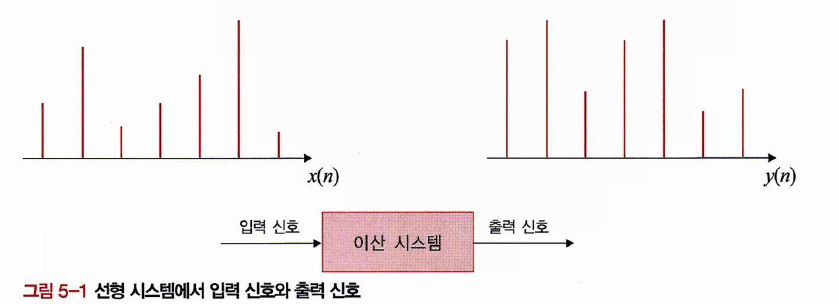

# Chapter 05: 선형 필터와 비선형 필터(5.1 ~ 5.2) - 작성자: 한지윤

# 📂 1. 신호와 시스템

## 📌 컨볼루션이란?

영어로 Convolution은 **‘대단히 복잡한 것, 난해한 것, 얽히고 설킨 것’** 등을 의미한다고 합니다.

<aside>

- 🔎 다들 **CNN** 대충 아시죠?
    
    **CNN**(Convolution Neural Network; 합성곱 신경망) : 딥러닝 모델중 하나
    
    
    
    - 인간의 시신경구조를 모방한 기술
    
    
    
    이미지에 필터를 적용하여 특징맵을 생성하는 과정 → Convolution Layer
    
</aside>

수학, 공학에서는 **컨볼루션(Convolution)**은 합성곱 이라고도 하며, 기존의 대수에서 하던 연산과는 다른, 새로운 연산 규칙을 말한다고 합니다. 

위 수식과 같이연산 부호는 `*`표이고, 곱셈과 적분 혹은 합으로 이루어져있습니다.

그리고 출력 $y(n)$의 주파수 평면 표현은 아래와 같습니다

<aside>

- 이걸 이해하려면 푸리에 변환 혹은 라플라스 변환을 통해 시간 영역에서 주파수 영역으로 전환하는 방법에 대해 이해해야하는데 아래 블로그 참고해주세요

https://supermemi.tistory.com/entry/%ED%91%B8%EB%A6%AC%EC%97%90-%EB%B3%80%ED%99%98%EA%B3%BC-%ED%95%A9%EC%84%B1%EA%B3%B1%EC%9D%98-%EA%B4%80%EA%B3%84Fourier-Transform-Convolution

</aside>

- **시간 축에서의 컨볼루션**이 **주파수축에서 단순 곱셈**으로 표현되는 것은 주파수 평면에서 필터를 해석 및 설계할 때 매우 유용한 특징

- 시간축에서는 컨볼루션으로 표현되는 것이 주파수축에서 단순 곱셈의 형태로 표현되므로 
**출력 특성을 쉽게 파악할 수 있음**
    
    
    

https://en.wikipedia.org/wiki/Convolution

- 주파수 $f$는 이산 신호의 정규화된 주파수로, 0.5가 해당 샘플링의 최대 주파수(샘플링 주파수의 1/2)에 해당함
→ `나이퀴스트 정리`때문이라고 합니다
- 실제 신호처리에서 사용하는 필터는 원점을 기준으로 대칭인 경우가 많음
- 이러한 경우, 컨볼루션과 상관 관계(Correlation)가 같아짐

- 참고
    
    https://blog.naver.com/PostView.naver?blogId=ycpiglet&logNo=222556985523
    

# 📂 2. 2차원 선형 필터

- 1차원이 시간축 개념을 사용한다면, 2차원 신호는 `공간` 이 도메인임
- 이러한 공간 도메인을 주파수축으로 변환하면 공간 주파수라는 개념을 사용함

영상 신호와 선형 영상처리 시스템의 입출력 관계식

주파수축에서의 표현

### 영상의 마스크

영상 신호처리에서는 마스크 개념을 사용함

입력 영상과 내적 계산법

<aside>

</aside>

## 📌 1. 저역 통과 필터

<aside>

### 고주파성분과 저주파 성분

| 성분 | 의미 | 예시 |
| --- | --- | --- |
| 고주파 성분 | 픽셀 값이 급격하게 변함 | 경계선, 노이즈 |
| 저주파 성분 | 픽셀 값이 완만하게 변함 | 배경, 그림자, 천천히 변하는 색 |
</aside>

→ 영상의 경계선이 흐려지고 부드러워짐

## 📌 2. 가우시안 필터와 잡음 제거

가우시안 필터는 **저역통과 필터(Low-Pass Filter)**의 대표적인 방법
특징은 **영상 전체를 부드럽게(blur)**만들어 주면서 **노이즈 제거**에도 효과적

- 분산값($σ$)에 따라 결과가 달라지게 됨
- 분산이 작으면 통과밴드가 넓다는 의미로 주파수 대부분을 통과시켜 원본 영상에 가깝게 유지됨
- 하지만 가우시안 필터의 분산을 크게하면 원본영상과 큰차이가 생기기되므로 **적당한 분산 파라미터**를 선정하는 것이 중요함

<aside>

- 가우시안 필터
    
    https://velog.io/@wyjung0731/Gaussian-Filter
    
    1. **Low-pass Filter, High-pass Filter**
    
    
    
    1. **Sharpening**
    
    
    
</aside>

# 📂 3. 소벨 연산자와 경계선 검출

- 고주파 통과 필터
- 경계선 검출에 유리함
- 경계선 검출은 영상처리에 매우 유용한 중간 결과를 가져옴

1. 위의 필터는 수평 소벨 필터는 $y$축을 기준으로 상하픽셀 간의 미분을 이용해 edge를 구하는 필터입니다.
2. 위의 필터는 수평 소벨 필터는 $*x*$축을 기준으로 좌우픽셀 간의 미분을 이용해 edge를 구하는 필터입니다.

https://velog.io/@mykirk98/SOBEL-FILTER

원본

수평

수직

결과

→ 태극기 무늬의 경계선이 검출되지 않음
근데 경계선 검출 결과를 보면 인간이 생각하는 경계를 완벽히 얻었다고 볼 수 없음
위치마다 임계값을 잘 설정하면 원하는 결과를 얻을 수 있긴한데 너무 어려움

# 📂 4. 라플라시안 필터와 경계선 검출

**1차 미분**을 이용한 에지 검출은 **에지가 있는 영역을 지날 때 민감**하게 반응하는 **단점**이 있음

하지만 **2차 미분**은 **1차 미분의 단점을 보완**하기 위해 수행한다. **밝기가 서서히 변하는 곳에서 반응이 둔화**되기 때문에 **에지 중심만 표시**하거나 **서서히 변하는 밝기에서는 아예 반응을 보이지 않을 수 있는 특성**이 있다.

**2차 미분 연산**은 **에지 부분**에서 부호가 바뀌는 **영 교차(zero crossing)**의 특성이 있다

출처: https://blog.naver.com/dorergiverny/223112156002

이게 LoG(Laplacian of Gaussian) 필터임

- 근데 몇가지 문제가 있음
    - 가우시안 필터를 사용할 경우 분산 값을 정하기 어려움
    - 가우시안 필터를 적용함에 따라 경계점의 위치가 이동함

# 📂 5. 캐니 에지 검출

1. 영상 잡음 제거를 위해 가우시안 필터 적용
2. 필터링된 밝깃값의 기울기, 크기, 방향 계산
3. Non-maximum suppression 단계에서 얇은 경계선 추출
4. Two-level threshold 단계에서 경계선을 추적
5. 경계선 추적을 통해 잘못된 경계선 제거

<aside>

- **GPT 피셜 답변**
    
    # 📌 2. 캐니 에지 검출기의 단계별 과정
    
    캐니 에지는 여러 단계를 거쳐 에지를 찾아냅니다.
    
    ---
    
    ### ✅ (1) 가우시안 필터로 노이즈 제거
    
    - 잡음도 에지처럼 보일 수 있기 때문에, 먼저 **가우시안 블러(저역통과 필터)** 로 영상을 부드럽게 만듭니다.
    - → 노이즈를 줄이고 진짜 에지만 남도록 준비.
    
    ---
    
    ### ✅ (2) 그래디언트(Gradient) 계산
    
    - 소벨(Sobel) 필터 같은 1차 미분 필터로 **밝기 변화(기울기)**를 계산합니다.
    - 크기: 얼마나 급격히 바뀌는지
    - 방향: 어느 방향으로 바뀌는지
    
    👉 이렇게 해서 "어디가 경계인지, 어떤 방향의 경계인지"를 알 수 있어요.
    
    ---
    
    ### ✅ (3) 비최대 억제 (Non-Maximum Suppression)
    
    - 에지가 두껍게 검출되지 않도록, **가장 뚜렷한(최대 기울기) 픽셀만 남기고 나머지는 제거**합니다.
    - → 결과: 얇고 날카로운 선(edge)만 남음.
    
    ---
    
    ### ✅ (4) 이중 임계값(Hysteresis Thresholding)
    
    - 임계값(Threshold)을 두 개 설정:
        - **높은 임계값(High Threshold): 확실한 에지**
        - **낮은 임계값(Low Threshold): 약한 에지 (하지만 강한 에지와 연결돼 있으면 유지)**
    - → 이렇게 하면 잡음은 제거되면서도 중요한 약한 에지는 놓치지 않게 돼요.
</aside>

https://velog.io/@mykirk98/Canny-Edge-Detection

<aside>

참고자료

- 컨벌루션, 임펄스, 선형시불변시스템

https://blog.naver.com/PostView.naver?blogId=ycpiglet&logNo=222556985523

- 선형필터, 박스필터, 가우시안필터

https://100s.tistory.com/40

- 주파수 영역 선형필터

https://famtech.tistory.com/43

</aside>