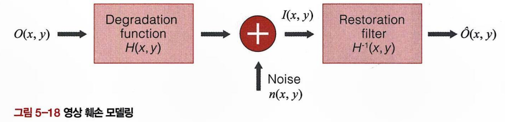

# Chapter 05: 선형 필터와 비선형 필터(5.3 ~ 5.4)

<aside>

### 💡 학습목표

- 신호와 시스템의 개념을 이해한다.
- 2차원 선형 필터의 개념과 구현 방법을 이해한다.
- 영상 복원의 개념과 그 방법을 이해한다.
- 비선형 필터의 개념과 구현 방법을 이해한다.
</aside>

<aside>

### 🗒️ 프리뷰

음성 신호는 시간 축에서 발현되어 신호를 표현할 수 있다. 이 신호를 주파수 평면에서 표현하면 주파수별로 에너지가 어느 정도 있는지 알 수 있다. 영상의 경우 공간 평면에서 정의된 신호는 2차원 공간 주파수 평면에서 표현할 수 있다. 이러한 주파수 평면은 신호와 시스템을 표현. 분석 및 설계하는 데 유용하다. 이때 신호처리에 필요한 기초 지식은 디지털 신호처리 내용을 참고한다.

이 장에서는 영상 신호를 처리하는 선형 필터와 비선형 필터를 살펴본다. 선형 시불변 필터는 신호처리에서 말하는 컨볼루션(convolution)으로 표현되는데, 이는 주파수 해석에도 용이하여 기본적인 필터로 유용하다. 선형성이 없는 비선형 필터는 주파수 평면 해석이 불가능하고 분석이 어려운 점이 있지만, 실제 많은 응용에서 선형 필터 대비 좋은 성능을 보일 수도 있어서 연구 개발이 많이 이루어진 분야이다. 지금부터 기초적인 신호 및 시스템에 기반한 선형 필터와 비선형 필터를 살펴보도록 하겠다.

</aside>

---

<aside>

# 영상 복원

</aside>

## 영상 처리의 대표적인 응용

- 화질 개선
- 영상 복원

## 각 응용의 차이점

| 구분     | 화질 개선 (Enhancement)   | 영상 복원 (Restoration)  |
| -------- | ------------------------- | ------------------------ |
| **목적** | 인간이 보기에 좋게 만들기 | 원본 신호로 되돌리기     |
| **기준** | 주관적 (인간의 시각)      | 객관적 (원본과의 일치도) |
| **예시** | 명암 조절, 색상 보정      | 블러 제거, 잡음 제거     |

## 영상이 손상되는 과정

카메라로 영상을 찍으면 다양한 이유로 원본과 다른 영상이 만들어진다.

- **초점 문제 (Defocusing)**: 렌즈의 초점이 맞지 않아 흐릿해짐
- **잡음 (Noise)**: 센서나 전송 과정에서 발생하는 무작위 신호

이렇게 훼손된 영상을 원 신호로 복원하기 위해서는 역필터링과 잡음 제거 필터가 필요하다.

관측 영상, 즉 손상된 영상인 $I(x,y)$는 다음과 같은 과정으로 표현할 수 있다.

이러한 과정을 시스템 관점에서 표현하면 다음 그림과 같이 필터링과 가산 잡음으로 모델링된다.

수식으로 표현하면 다음과 같다.

$$
I(x,y)=O(x,y)×H(x,y)+n(x,y)
$$

- $I(x,y)$: 관측된 손상 영상
- $O(x,y)$: 원본 영상
- $H(x,y)$: 시스템 필터 (PSF: Point Spread Function)
- $n(x,y)$: 잡음

원본 영상 $O(x,y)$에 어떠한 필터(defocusing)가 적용되고 여기에 잡음이 추가된다.

> 💡 **PSF(Point Spread Function)란?**
>
> 이상적으로는 점과 같은 임펄스(impulse) 신호가 입력되면 점 그대로 출력되어야 하지만, 실제로는 일부 저역 주파수만을 통과시키므로 점이 번져서 가우시안 형태로 퍼지게 된다. 이렇게 점이 퍼지는 특성을 나타낸 것이 PSF입니다.

## 영상 복원의 이론적 접근

원본 영상을 복원하려면 역과정을 수행하면 된다.

$H(x,y)$를 안다면 역변환을 수행하여 원 신호를 얻을 수 있다. 원 신호를 수학적으로 표현하면 다음과 같다.

$$
O(x,y) = H^{-1}(x,y) \times (I(x,y) - n(x,y))
$$

**과정**

1. $I(x,y)$에서 잡음 $n(x,y)$ 제거
2. 역변환 $H^{-1}(x,y)$로 필터링 적용 (역필터)

변형된 취득 영상 $I(x,y)$에서 잡음을 제거하고 시스템 필터 $H(x,y)$의 역변환으로 필터링을 적용하면 원 신호를 얻을 수 있다. 하지만 이러한 과정은 이론적으로만 가능할 뿐 실질적으로는 불가능에 가깝다.

## 실제로는 불가능한 이유

이론은 완벽해 보이지만, 현실에서는 다음과 같은 문제들이 있다.

### **문제 1: 잡음 완전 제거의 어려움**

- 잡음을 100% 제거하기는 거의 불가능
- 복원 영상에 남은 잡음 $H^{-1}(x,y) \times n(x,y)$이 역필터를 거치면서 **증폭**됨
- 작은 잡음도 $H^{-1}(x,y)$를 거치면 커다란 잡음이 됨

### **문제 2: 역필터의 불안정성**

- $H^{-1}(x,y)$가 존재하지 않는 경우가 많음
- 존재하더라도 값이 매우 커서 불안정함
- 작은 오차가 큰 결과 차이를 만듦

### 실용적인 해결 방법

완전한 복원은 불가능하므로 역변환을 통한 영상 복원은 사용되지 않고, **안정화된 근사 방법을 사용**한다.

- **안정화 항 추가**: $H^{-1}(x,y)$가 너무 커지지 않도록 제약 조건(안정화 항) 추가

하지만 이를 통해 문제를 해결한다고 해도 실제로는 **$H(x,y)$나 잡음 특성을 정확히 모르는 경우가 일반적**이므로, 다양한 방법으로 잡음의 분산과 같은 파라미터나 시스템 함수를 알아내기 위한 연구가 진행되어 왔다.

---

<aside>

# 비선형 필터

</aside>

## 선형 필터의 한계

지금까지 배운 가우시안 필터, 소벨 필터 등은 모두 **선형 필터**였다.

### **선형 시불변 필터의 장점**

- 주파수 분석 가능
- 이론적으로 해석 가능
- 디지털 신호처리 이론 모두 적용 가능

### **선형 필터의 단점**

- 개발에 한계가 있음 (모든 상황에 적합하지 않음)
- 특정 잡음에는 효과가 없음

예를 들어, 고주파 쪽에 잡음이 몰려 있다는 가정하에 저역 통과 필터를 사용하지만 실제로는 잡음이 고주파 쪽에 있지 않은 경우가 많다.

## 임펄스 잡음과 선형 필터의 문제

특성이 일정하지 않은 임펄스 형태의 잡음을 예로 들어보자. 이 경우에 잡음의 주파수 분포는 매우 다양하게 나타날 것이므로 가우시안 필터와 같은 선형 필터로는 해결할 수 없다. 다음 그림은 입력 영상에 임펄스 잡음이 첨가된 경우와 가우시안 필터를 적용한 경우를 보여 준다.

> **임펄스 잡음(Salt & Pepper Noise)**이란?
>
> - 무작위로 픽셀 값이 최대(255, 하얗게) 또는 최소(0, 검게)로 바뀌는 잡음
> - 소금(흰 점)과 후추(검은 점)를 뿌린 것 같다고 해서 붙은 이름

### **문제점**

- (c) 그림을 보면 임펄스 잡음이 제거되기보다 **주변으로 퍼짐**
- 경계선도 함께 뭉개지는 현상도 발생

가우시안 필터는 **평균을 구하는 방식**이므로, 극단적인 값(0 또는 255)이 주변으로 번지게 된다.

## 문제 해결: 중간값 필터 (Median Filter)

이러한 문제를 해결하기 위해 **중간값 필터**를 사용한다.

중간값 필터는 한 점을 중심으로 유한한 크기의 윈도 안에 샘플값을 크기에 따라 정렬하고, 그 크기가 중간 순위에 해당하는 샘플을 필터의 결과로 취하는 것이다. 이러한 방법은 정렬 과정과 중간 순위를 뽑는 과정이 선형적이지 않지만, 다양한 형태의 잡음에 매우 둔감한 특성이 있다. 또한, 경계 부분에서 주변의 값으로 평균을 취하는 것이 아니어서 경계선의 형태를 잘 유지한다는 특성을 보인다.

### **동작 원리**

1. 현재 픽셀 주변의 윈도(예: 3×3) 내 픽셀값들을 수집
2. 이 값들을 **크기 순서대로 정렬**
3. **중간 순위의 값**을 결과로 선택

이미지 출처: [https://www.southampton.ac.uk/~msn/book/new_demo/median/](https://www.southampton.ac.uk/~msn/book/new_demo/median/)

현재 픽셀의 값을 윈도 내의 픽셀 값 중 중간 순위의 것과 교체하면서 필터링을 수행한다. 이러한 중간값 필터는 영상에 생길 수 있는 여러 가지 잡음 중 임펄스 잡음 제거에 탁월한 효과를 줄 수 있다. 필터링하려는 현재 픽셀과 그 주변 픽셀을 윈도라고 하는데, 윈도의 크기는 3x3, 5x5, 7X7 등으로 다양하다.

윈도의 크기가 클수록 임펄스 잡음이 중간 순위에 영향을 줄 확률은 낮아진다. 알고리즘의 입력으로 잡음이 섞인 이미지가 들어가는데 입력 이미지의 첫 번째 픽셀부터 마지막 픽셀까지 필터링이 진행된다. 윈도 내의 픽셀을 값에 따라 정렬한 후 중간값에 해당하는 픽셀값을 결과 버퍼에 복사하여 최종 결과를 얻을 수 있다.

다음 그림은 원본 영상, 임펄스 잡음으로 손상된 영상, 중간값 필터로 복원한 영상을 보여 준다. 또한, 70번째 라인의 밝기 값을 1차원 신호로 보여 준다

필터를 적용하면 다소 흐려지는 가중 평균 필터와 달리 중간값 필터는 좁은 위치에서의 세세한 변화가 다소 사라지는 대신 사물의 윤곽선이 뚜렷하게 유지되는 특성이 있음을 알 수 있다.

## **중간값 필터의 장점**

1. **임펄스 잡음에 강함**: 극단값이 중간 순위에 영향을 주지 못함
2. **경계선 보존**: 평균이 아니므로 경계가 뭉개지지 않음
3. **적응적 특성**: 주변 픽셀 중 대표값을 자동으로 선택

> **중간값 필터가 비선형 필터인 이유**
>
> - 정렬 과정이 선형적이지 않음
> - 주파수 분석 불가능

## 중간값 필터의 한계와 개선

### **한계점**

1. **윈도 크기 결정의 어려움**
   - 너무 작으면: 잡음이 중간 순위에 포함될 수 있음
   - 너무 크면: 계산량 증가
2. **혼합 잡음**
   - 임펄스 잡음과 가우시안 잡음이 동시에 있으면?
   - 중간값만으로는 부족할 수 있음

하지만 이러한 방법은 중간 순위에 잡음이 포함되지 않는다는 가정을 할 경우에만 유효하다. 임펄스 잡음이 중간 순위까지 영향을 주거나 중간 순위에 있지 않더라도 또 다른 형태의 잡음(예: 가우시안 잡음)이 포함될 수도 있다. 이러한 경우에는 중간값 필터도 효과적이라고 말할 수 없다.

### **개선 방법**

**1. 적응적 중간값 필터 (Adaptive Median Filter)**

<aside>

1. 작은 윈도(3×3)에서 시작
2. 중간값이 임펄스로 판단되면
3. 윈도 크기를 점점 확대(5×5, 7×7, …)
4. 정상적인 중간값을 찾을 때까지 반복
</aside>

**2. Alpha-Trimmed 필터:** 혼합 잡음(임펄스 + 가우시안)을 처리하기 위한 방법

<aside>

1. 윈도 내 픽셀값 정렬
2. 양 끝의 극단값 α개씩 제거 (임펄스 제거)
3. 남은 값들의 **평균** 계산 (가우시안 잡음 완화)
</aside>

예시 ($0 < \alpha < 0.5$)

<aside>

정렬된 값: [2, 4, 5, 6, 9, 11, 21, 24, 30] ——- (양 끝 2개씩 제거) —-—>
남은 값: [5, 6, 9, 11, 21]

결과 = 평균(5, 6, 9, 11, 21) ≈ 10

</aside>

결과적으로

- 임펄스는 제거되고 (양 끝 제거)
- 가우시안 잡음은 평균화로 완화됨

이처럼 비선형 필터는 다양하게 개발되고 있으며, 유용성이 큰 경우도 많다.

---

<aside>

# 정리

</aside>

## **영상 복원**

- 원본으로 되돌리는 것이 목표
- 이론적으로는 역필터 사용
- 실제로는 잡음과 불안정성 때문에 근사 방법 사용

## **비선형 필터**

- 선형 필터로 해결 안 되는 문제 처리
- 중간값 필터: 임펄스 잡음에 효과적
- Alpha-Trimmed: 혼합 잡음 처리

## **필터 선택**

- 가우시안 잡음 → 가우시안 필터
- 임펄스 잡음 → 중간값 필터
- 혼합 잡음 → Alpha-Trimmed 필터
